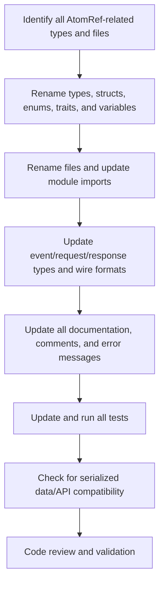

# Rename Plan: AtomRef → Molecule

## Scope

**All AtomRef-related concepts will be renamed to Molecule equivalents:**
- Types: `AtomRef`, `AtomRefRange`, `AtomRefStatus`, `AtomRefUpdate`, `AtomRefBehavior`
- Event/request/response types: `AtomRefCreated`, `AtomRefUpdateRequest`, etc.
- All files and modules: `atom_ref.rs`, `atom_ref_range.rs`, `atom_ref_types.rs`, `atom_ref_behavior.rs`, `atom_ref_tests.rs`
- All code references, comments, documentation, and error messages

---

## Steps

1. **Enumerate All Affected Symbols and Files**
   - Identify every type, struct, enum, trait, function, and file/module with `AtomRef` in its name.

2. **Automated and Manual Refactoring**
   - Use IDE/refactoring tools for code, then manually update comments, error messages, and documentation.
   - Rename all relevant files and update all module imports and references.

3. **Update Event, API, and Serialization Types**
   - Update all event/request/response types and their wire formats.
   - Check for any serialized data or API contracts that may require migration or versioning.

4. **Update and Validate Tests**
   - Update all test code and ensure all tests pass after the rename.

5. **Documentation and Communication**
   - Update all documentation, comments, and error messages for clarity and consistency.
   - Communicate changes to any downstream consumers or teams.

---

## Estimated Effort

| Area                | Estimated Effort | Notes                                      |
|---------------------|------------------|--------------------------------------------|
| Codebase Rename     | 2-4 hours        | IDE-assisted, manual review required       |
| File/Module Rename  | 1 hour           | Update imports, mod declarations           |
| Docs/Comments       | 1 hour           | Manual search and update                   |
| Tests               | 1 hour           | Update and re-run all tests                |
| API/Serialization   | 1-3 hours        | If migration/compat needed                 |
| **Total**           | **6-13 hours**   | 1-2 days for a single dev                  |

---

## Risks & Recommendations

- **Breaking changes** to APIs or serialized data: plan for migration/versioning if needed.
- **Incomplete rename**: mitigate with regex search, code review, and thorough testing.
- **Downstream dependencies**: communicate changes and provide migration notes.

---

## Summary Diagram

---

**This is a large, but straightforward, refactor that will require careful, comprehensive changes across the codebase, tests, and documentation. Estimated effort is 6-13 hours (1-2 days for a single developer).**