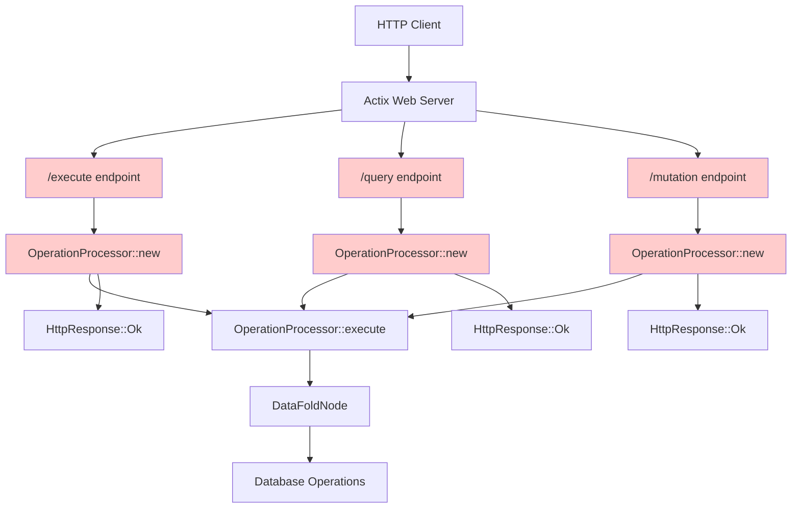
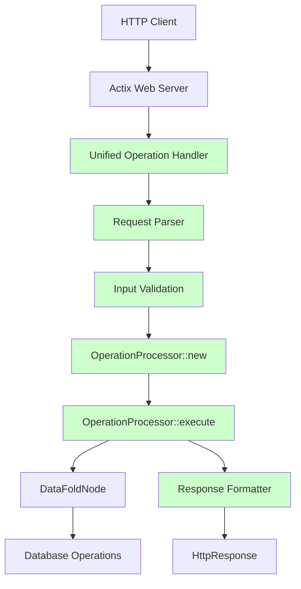

# HTTP Endpoint Duplication Analysis

## Executive Summary

The DataFold HTTP API suffers from significant code duplication across multiple endpoints that all implement the same core pattern: **parse request → create OperationProcessor → execute operation → return response**. This analysis identifies the duplication, explains why it exists, and provides recommendations for consolidation.

## Current Duplication Pattern

### Identified Duplicated Endpoints

1. **`/execute`** - Generic operation execution
2. **`/query`** - Query-specific execution  
3. **`/mutation`** - Mutation-specific execution
4. **TCP Command Router** - Network operation execution

### Duplication Analysis

Each endpoint implements the exact same 4-step pattern:

```rust
// Step 1: Parse request data
let operation: Operation = parse_request_data(request)?;

// Step 2: Create processor
let node_arc = Arc::clone(&state.node);
let processor = OperationProcessor::new(node_arc);

// Step 3: Execute operation
match processor.execute(operation).await {
    Ok(result) => /* success response */,
    Err(e) => /* error response */
}

// Step 4: Return HTTP response
HttpResponse::Ok().json(json!({"data": result}))
```

## Current Architecture Diagram



## Detailed Code Duplication

### Pattern 1: Generic Operation Execution (`/execute`)

```rust
pub async fn execute_operation(
    request: web::Json<OperationRequest>,
    state: web::Data<AppState>,
) -> impl Responder {
    // Parse operation string
    let operation: Operation = match serde_json::from_str(operation_str) {
        Ok(op) => op,
        Err(e) => return HttpResponse::BadRequest()
            .json(json!({"error": format!("Failed to parse operation: {}", e)}));
    };

    // Create processor with the node
    let node_arc = Arc::clone(&state.node);
    let processor = OperationProcessor::new(node_arc);

    // Execute operation
    match processor.execute(operation).await {
        Ok(result) => HttpResponse::Ok().json(json!({"data": result})),
        Err(e) => HttpResponse::InternalServerError()
            .json(json!({"error": format!("Failed to execute operation: {}", e)})),
    }
}
```

### Pattern 2: Query-Specific Execution (`/query`)

```rust
pub async fn execute_query(query: web::Json<Value>, state: web::Data<AppState>) -> impl Responder {
    // Parse query with validation
    let web_operation = match serde_json::from_value::<Operation>(query_value) {
        Ok(op) => match op {
            Operation::Query { .. } => op,
            _ => return HttpResponse::BadRequest()
                .json(json!({"error": "Expected a query operation"}))
        },
        Err(e) => return HttpResponse::BadRequest()
            .json(json!({"error": format!("Failed to parse query: {}", e)}))
    };

    // Create processor with the node (IDENTICAL)
    let node_arc = Arc::clone(&state.node);
    let processor = OperationProcessor::new(node_arc);

    // Execute operation (IDENTICAL)
    match processor.execute(web_operation).await {
        Ok(results) => HttpResponse::Ok().json(json!({"data": results})),
        Err(e) => HttpResponse::InternalServerError()
            .json(json!({"error": format!("Failed to execute query: {}", e)})),
    }
}
```

### Pattern 3: Mutation-Specific Execution (`/mutation`)

```rust
pub async fn execute_mutation(
    mutation_data: web::Json<Value>,
    state: web::Data<AppState>,
) -> impl Responder {
    // Parse mutation with validation
    let web_operation = match serde_json::from_value::<Operation>(mutation_data.into_inner()) {
        Ok(op) => match op {
            Operation::Mutation { .. } => op,
            _ => return HttpResponse::BadRequest()
                .json(json!({"error": "Expected a mutation operation"}))
        },
        Err(e) => return HttpResponse::BadRequest()
            .json(json!({"error": format!("Failed to parse mutation: {}", e)}))
    };

    // Create processor with the node (IDENTICAL)
    let node_arc = Arc::clone(&state.node);
    let processor = OperationProcessor::new(node_arc);

    // Execute operation (IDENTICAL)
    match processor.execute(web_operation).await {
        Ok(_) => HttpResponse::Ok().json(json!({"success": true})),
        Err(e) => HttpResponse::InternalServerError()
            .json(json!({"error": format!("Failed to execute mutation: {}", e)})),
    }
}
```

### Pattern 4: TCP Command Router

```rust
// In TcpServer::process_request
match operation {
    "query" => {
        // Parse query parameters...
        let operation = crate::schema::types::Operation::Query { /* ... */ };
        
        // Create processor with the node (IDENTICAL)
        let processor = OperationProcessor::new(node.clone());
        let result = processor.execute(operation).await?;
        
        Ok(serde_json::json!({"results": result, "errors": []}))
    }
    "mutation" => {
        // Parse mutation parameters...
        let operation = crate::schema::types::Operation::Mutation { /* ... */ };
        
        // Create processor with the node (IDENTICAL)
        let processor = OperationProcessor::new(node.clone());
        let _ = processor.execute(operation).await?;
        
        Ok(serde_json::json!({"success": true}))
    }
}
```

## Root Cause Analysis

### Why This Duplication Exists

1. **Incremental Development**: Endpoints were likely added one at a time without refactoring existing code
2. **Different Input Formats**: Each endpoint accepts slightly different request formats:
   - `/execute`: `{"operation": "json_string"}`
   - `/query`: `{operation_json_object}`
   - `/mutation`: `{operation_json_object}`
   - TCP: `{"operation": "type", "params": {...}}`
3. **Validation Requirements**: Each endpoint has different validation rules
4. **Response Formatting**: Slight differences in response structure

### The OperationProcessor Success Story

Interestingly, the `OperationProcessor` was created to solve exactly this problem, but it was only partially adopted:

- ✅ **Successfully consolidated** the core operation execution logic
- ❌ **Failed to consolidate** the HTTP endpoint boilerplate

## Proposed Solution Architecture

### Unified Operation Endpoint Handler



### Implementation Strategy

#### Phase 1: Create Unified Handler

```rust
pub struct UnifiedOperationHandler {
    node: Arc<Mutex<DataFoldNode>>,
}

impl UnifiedOperationHandler {
    pub async fn handle_request(
        &self,
        request_type: RequestType,
        data: Value,
    ) -> impl Responder {
        // Parse request based on type
        let operation = self.parse_request(request_type, data)?;
        
        // Validate operation
        self.validate_operation(&operation)?;
        
        // Execute using OperationProcessor (existing logic)
        let processor = OperationProcessor::new(self.node.clone());
        let result = processor.execute(operation).await?;
        
        // Format response
        self.format_response(result, request_type)
    }
}
```

#### Phase 2: Update Route Handlers

```rust
// Replace all three endpoints with thin wrappers
pub async fn execute_operation(
    request: web::Json<OperationRequest>,
    state: web::Data<AppState>,
) -> impl Responder {
    let handler = UnifiedOperationHandler::new(state.node.clone());
    handler.handle_request(RequestType::Generic, request.operation.clone()).await
}

pub async fn execute_query(
    query: web::Json<Value>,
    state: web::Data<AppState>,
) -> impl Responder {
    let handler = UnifiedOperationHandler::new(state.node.clone());
    handler.handle_request(RequestType::Query, query.into_inner()).await
}

pub async fn execute_mutation(
    mutation_data: web::Json<Value>,
    state: web::Data<AppState>,
) -> impl Responder {
    let handler = UnifiedOperationHandler::new(state.node.clone());
    handler.handle_request(RequestType::Mutation, mutation_data.into_inner()).await
}
```

## Benefits of Consolidation

### Code Reduction
- **Before**: ~120 lines of duplicated code across 3 endpoints
- **After**: ~40 lines of shared handler + ~15 lines per endpoint wrapper
- **Savings**: ~65 lines of code elimination

### Maintenance Benefits
1. **Single Source of Truth**: All operation handling logic in one place
2. **Consistent Error Handling**: Unified error response format
3. **Easier Testing**: Test the handler once instead of each endpoint
4. **Simplified Debugging**: Single code path to trace

### Consistency Benefits
1. **Unified Logging**: Consistent logging across all endpoints
2. **Standardized Responses**: Same response format for all operations
3. **Error Message Consistency**: Same error handling logic

## Migration Plan

### Step 1: Create Unified Handler (1-2 days)
- Extract common logic into `UnifiedOperationHandler`
- Implement request parsing for all input formats
- Add comprehensive validation

### Step 2: Update Endpoints (1 day)
- Replace endpoint implementations with thin wrappers
- Maintain backward compatibility
- Update tests

### Step 3: TCP Integration (1 day)
- Apply same pattern to TCP command router
- Consolidate network operation handling

### Step 4: Testing & Validation (1-2 days)
- Ensure all endpoints work identically
- Performance testing
- Integration testing

## Risk Assessment

### Low Risk
- **OperationProcessor already exists**: Core execution logic is proven
- **Input/Output contracts unchanged**: No breaking API changes
- **Gradual migration possible**: Can be done incrementally

### Mitigation Strategies
- **Comprehensive testing**: Ensure identical behavior
- **Feature flags**: Ability to rollback if issues arise
- **Monitoring**: Track performance and error rates

## Conclusion

The current duplication represents a classic case of **incomplete refactoring** - the `OperationProcessor` successfully consolidated the core execution logic, but the HTTP endpoint boilerplate was never addressed. 

**Recommendation**: Implement the `UnifiedOperationHandler` to complete the consolidation effort started by `OperationProcessor`. This will eliminate ~65 lines of duplicated code, improve maintainability, and ensure consistent behavior across all operation endpoints.

The duplication exists because each endpoint was developed incrementally with slightly different requirements, but the core pattern is identical. The solution leverages the existing `OperationProcessor` success and extends it to cover the remaining boilerplate code.
