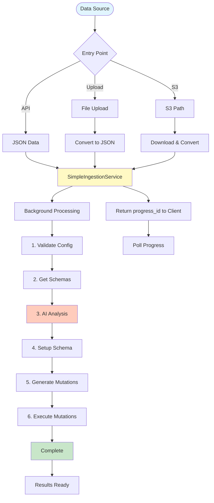
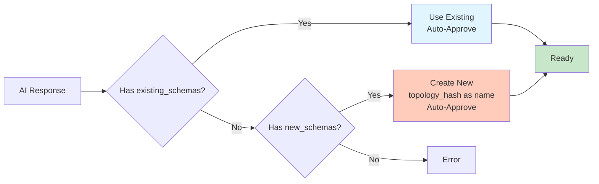

# Ingestion Workflow - Quick Reference

## Overview Diagram



## Processing Steps

| Step | Progress | Duration | Description |
|------|----------|----------|-------------|
| **1. Validate Config** | 0% | <100ms | Check AI service configuration |
| **2. Prepare Schemas** | 15% | 100-500ms | Fetch and strip schemas (cached) |
| **2.5. Flatten Data** | 30% | <100ms | Flatten nested structures |
| **3. AI Recommendation** | 45% | 2-5s | AI analyzes data and suggests schema |
| **4. Setup Schema** | 60% | 100-500ms | Use existing or create new schema |
| **5. Generate Mutations** | 75% | 50-200ms | Create database mutations |
| **6. Execute Mutations** | 90-100% | 1-3s | Write to database (if auto_execute) |

## Entry Points

### 1. Direct JSON (API)
```bash
POST /api/ingestion/process
Content-Type: application/json

{
  "data": {...},
  "auto_execute": true
}

→ Returns: {"progress_id": "..."}
```

### 2. File Upload
```bash
POST /api/ingestion/upload
Content-Type: multipart/form-data

file=@data.json
autoExecute=true

→ Returns: {"progress_id": "..."}
```

### 3. S3 Ingestion
```rust
let request = S3IngestionRequest::new("s3://bucket/file.json");
let response = ingest_from_s3_path_async(&request, ...).await?;
// Returns: progress_id
```

## Schema Decision



## Mutation Flow

```
JSON Data → Extract Fields → Apply Mappers → Create Mutation → Execute
                                                    ↓
                            Add: schema_name, trust_distance, pub_key, source_file_name
```

## Progress Tracking

```javascript
// Poll every 500ms
const pollProgress = async (progressId) => {
  const res = await fetch(`/api/ingestion/progress/${progressId}`);
  const progress = await res.json();
  
  console.log(progress.progress_percentage, progress.message);
  
  if (progress.is_complete) {
    return progress.results;
  }
};
```

## Key Files

| File | Purpose |
|------|---------|
| `simple_service.rs` | Main orchestration |
| `routes.rs` | HTTP endpoints |
| `file_upload.rs` | File upload handling |
| `s3_ingestion.rs` | S3 integration |
| `mutation_generator.rs` | Create mutations |
| `openrouter_service.rs` | OpenRouter AI |
| `ollama_service.rs` | Ollama local AI |
| `progress.rs` | Progress tracking |

## Configuration

```bash
# Quick setup
export AI_PROVIDER=openrouter
export FOLD_OPENROUTER_API_KEY=sk-...
export INGESTION_ENABLED=true
export INGESTION_AUTO_EXECUTE=true
```

## Common Operations

### Check Status
```bash
curl http://localhost:9001/api/ingestion/status
```

### View Progress
```bash
curl http://localhost:9001/api/ingestion/progress/{progress_id}
```

### Ingest File
```bash
curl -X POST http://localhost:9001/api/ingestion/upload \
  -F "file=@data.json" \
  -F "autoExecute=true"
```

## Error Handling

```
Error → Classify → Retry (if AI) → Update Progress → Return Error
                                           ↓
                                   Set error_message
                                   Set is_complete=true
```

## Data Flow Summary

```
Request → Pre-Process → Spawn Background Task → Return progress_id
                              ↓
            [Background: Validate → Schemas → AI → Setup → Generate → Execute]
                              ↓
                          Complete Progress (100%)
                              ↓
                    Client Polls & Gets Results
```

---

**For detailed documentation, see:** [INGESTION_WORKFLOW.md](./INGESTION_WORKFLOW.md)

