# Ingestion Workflow Documentation

> **Complete Technical Reference** - Updated November 2025

## Table of Contents

1. [Overview](#overview)
2. [Entry Points](#entry-points)
3. [Complete Workflow Diagram](#complete-workflow-diagram)
4. [Detailed Component Flows](#detailed-component-flows)
5. [Code Architecture](#code-architecture)
6. [Progress Tracking System](#progress-tracking-system)
7. [Schema Decision Tree](#schema-decision-tree)
8. [Mutation Generation](#mutation-generation)
9. [Error Handling Strategy](#error-handling-strategy)
10. [Examples & Usage](#examples--usage)

---

## Overview

The FoldDB ingestion engine is an AI-powered system that:
- Accepts JSON data from multiple sources (API, file uploads, S3)
- Automatically determines appropriate schemas using AI
- Generates and executes database mutations
- Provides real-time progress tracking
- Handles schema creation and approval automatically

**Key Features:**
- 🤖 AI-powered schema detection (OpenRouter/Ollama)
- 📊 Real-time progress tracking with detailed steps
- 🔄 Support for both single objects and arrays
- 📁 Multiple input formats (JSON, CSV, Twitter archives)
- ☁️ S3 integration for cloud storage
- 🎯 Automatic schema creation and approval
- 🔍 Content-based duplicate detection

---

## Entry Points

The ingestion system has three main entry points:

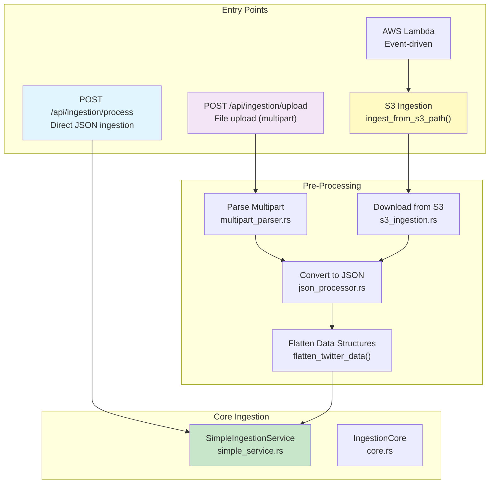

### Entry Point Details

| Entry Point | File | Use Case | Returns |
|------------|------|----------|---------|
| **POST /api/ingestion/process** | `routes.rs:process_json()` | Direct JSON data ingestion | `progress_id` immediately |
| **POST /api/ingestion/upload** | `file_upload.rs:upload_file()` | File upload with conversion | `progress_id` immediately |
| **ingest_from_s3_path_async()** | `s3_ingestion.rs` | Programmatic S3 ingestion | `progress_id` immediately |
| **ingest_from_s3_path_sync()** | `s3_ingestion.rs` | Blocking S3 ingestion | Final results after completion |

---

## Complete Workflow Diagram

```mermaid
flowchart TD
    Start([Request Received]) --> EntryCheck{Entry Point?}
    
    %% Entry Points
    EntryCheck -->|API| ValidateJSON[Validate JSON]
    EntryCheck -->|Upload| ParseFile[Parse Multipart]
    EntryCheck -->|S3| DownloadFile[Download from S3]
    
    ParseFile --> CheckDuplicate{Already Exists?}
    CheckDuplicate -->|Yes| ReturnDupe[Return Duplicate Response]
    CheckDuplicate -->|No| ConvertJSON[Convert File to JSON]
    
    DownloadFile --> ConvertJSON
    ConvertJSON --> FlattenData[Flatten Twitter Data]
    ValidateJSON --> FlattenData
    
    %% Core Processing Flow
    FlattenData --> StartProgress[Create Progress ID<br/>Start Progress Tracking]
    StartProgress --> SpawnBackground[Spawn Background Task]
    SpawnBackground --> ReturnProgressID[Return progress_id to Client]
    
    %% Background Processing (happens after returning to client)
    SpawnBackground -.Background Thread.-> Step1
    
    subgraph BackgroundProcessing["Background Processing (Async)"]
        Step1[Step 1: Validate Config<br/>0%] --> Step2[Step 2: Prepare Schemas<br/>15%]
        Step2 --> GetSchemas[Fetch Available Schemas<br/>from SchemaManager]
        GetSchemas --> StripSchemas[Strip Sensitive Data<br/>payment, permissions]
        StripSchemas --> Step3[Step 2.5: Flatten Data<br/>30%]
        Step3 --> Step4[Step 3: Get AI Recommendation<br/>45%]
        
        Step4 --> AICall{AI Provider?}
        AICall -->|OpenRouter| OpenRouterAPI[OpenRouter Service<br/>Claude 3.5 Sonnet]
        AICall -->|Ollama| OllamaAPI[Ollama Service<br/>Local Models]
        
        OpenRouterAPI --> AIResponse[AISchemaResponse]
        OllamaAPI --> AIResponse
        
        AIResponse --> Step5[Step 4: Setup Schema<br/>60%]
        
        Step5 --> SchemaDecision{Schema Decision}
        
        SchemaDecision -->|Existing Schema| UseExisting[Use existing_schemas first]
        SchemaDecision -->|New Schema| CreateSchema[Create New Schema]
        
        UseExisting --> EnsureTopologies[Ensure Schema Has Topologies]
        EnsureTopologies --> AutoApprove1[Auto-Approve Schema]
        
        CreateSchema --> DeserializeSchema[Deserialize Schema from AI]
        DeserializeSchema --> AddKeyConfig[Add Default Key Config<br/>if missing]
        AddKeyConfig --> ComputeHash[Compute Topology Hash]
        ComputeHash --> SetSchemaName[Use topology_hash as name]
        SetSchemaName --> StoreSchema[Store in SchemaManager]
        StoreSchema --> AutoApprove2[Auto-Approve Schema]
        
        AutoApprove1 --> Step6[Step 5: Generate Mutations<br/>75%]
        AutoApprove2 --> Step6
        
        Step6 --> DataType{Data Type?}
        DataType -->|Array| IterateItems[Iterate Array Items]
        DataType -->|Object| ProcessSingle[Process Single Object]
        
        IterateItems --> ExtractFields1[Extract Fields from Item]
        ProcessSingle --> ExtractFields2[Extract Fields from Object]
        
        ExtractFields1 --> ApplyMappers1[Apply Mutation Mappers]
        ExtractFields2 --> ApplyMappers2[Apply Mutation Mappers]
        
        ApplyMappers1 --> CreateMutation1[Create Mutation]
        ApplyMappers2 --> CreateMutation2[Create Mutation]
        
        CreateMutation1 --> AddMetadata1[Add trust_distance<br/>pub_key, source_file_name]
        CreateMutation2 --> AddMetadata2[Add trust_distance<br/>pub_key, source_file_name]
        
        AddMetadata1 --> CheckMore{More Items?}
        CheckMore -->|Yes| IterateItems
        CheckMore -->|No| CollectMutations[Collect All Mutations]
        AddMetadata2 --> CollectMutations
        
        CollectMutations --> Step7[Step 6: Execute Mutations<br/>90%]
        
        Step7 --> AutoExec{auto_execute?}
        AutoExec -->|true| ExecuteBatch[Execute Mutations Batch]
        AutoExec -->|false| SkipExec[Skip Execution]
        
        ExecuteBatch --> BatchLoop[For Each Mutation]
        BatchLoop --> ConvertOp[Convert to Operation]
        ConvertOp --> ExecuteDB[Execute in Database]
        ExecuteDB --> UpdateProgress[Update Progress]
        UpdateProgress --> MoreMutations{More?}
        MoreMutations -->|Yes| BatchLoop
        MoreMutations -->|No| Complete
        
        SkipExec --> Complete[Complete Progress<br/>100%]
    end
    
    Complete --> StoreResults[Store Results in ProgressTracker]
    StoreResults --> End([Client Polls for Results])
    
    ReturnDupe --> End
    ReturnProgressID --> End
    
    style Start fill:#e1f5fe
    style End fill:#c8e6c9
    style BackgroundProcessing fill:#f5f5f5
    style AIResponse fill:#fff9c4
    style Complete fill:#c8e6c9
    style CreateSchema fill:#ffccbc
    style ExecuteBatch fill:#b2dfdb
```

---

## Detailed Component Flows

### 1. File Upload Flow

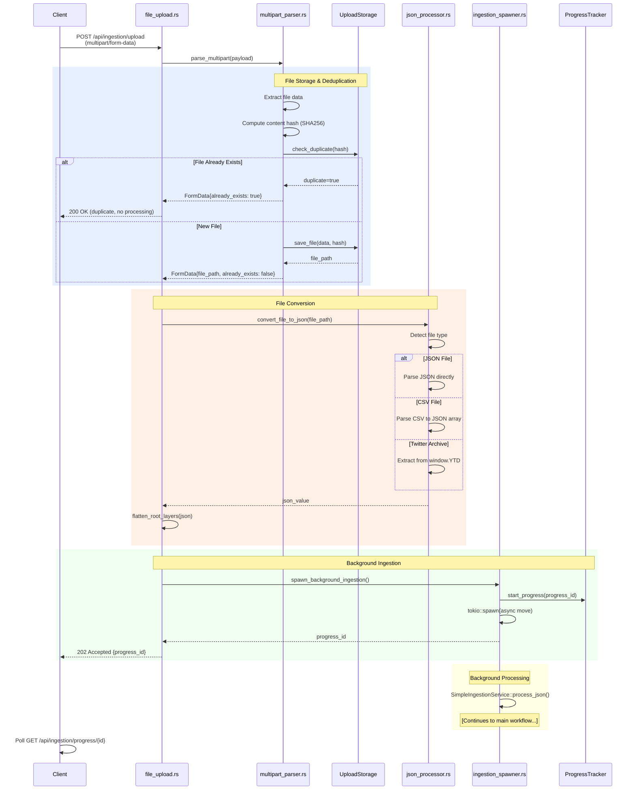

### 2. S3 Ingestion Flow

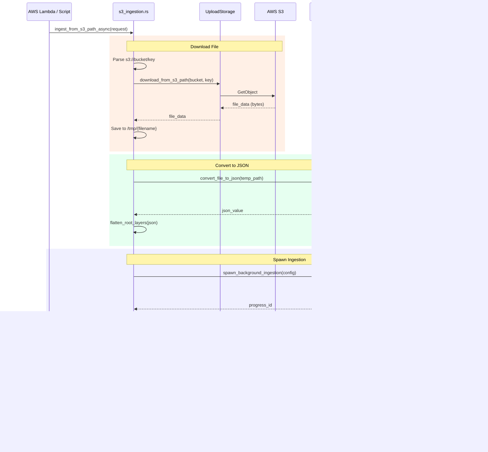

### 3. AI Schema Recommendation Flow

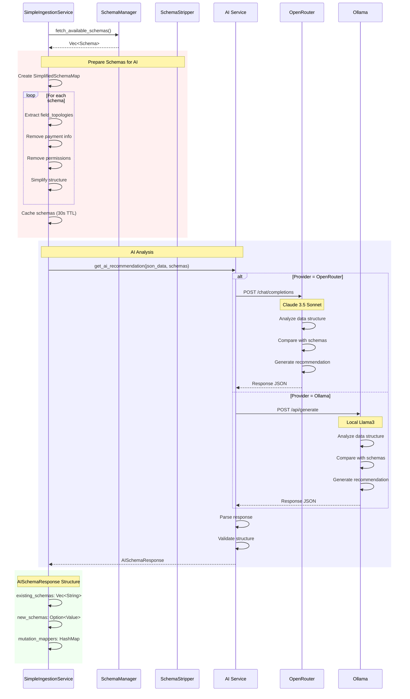

### 4. Schema Creation & Approval Flow

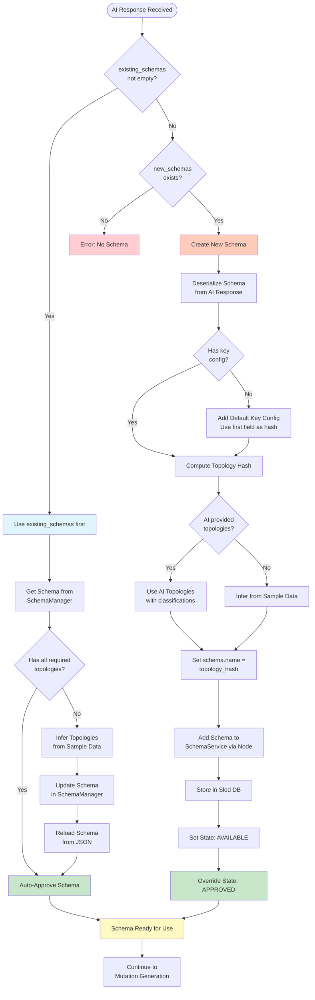

### 5. Mutation Generation & Execution Flow

```mermaid
flowchart TD
    Start([Schema Ready]) --> CheckDataType{Data Type?}
    
    %% Array Processing
    CheckDataType -->|Array| GetArrayItems[Get Array Items]
    GetArrayItems --> IterateLoop{For Each Item}
    
    IterateLoop -->|Next Item| CheckItemType{Is Object?}
    CheckItemType -->|Yes| ExtractFieldsArray[Extract Fields & Values]
    CheckItemType -->|No| SkipItem[Skip Item - Log Warning]
    SkipItem --> IterateLoop
    
    %% Object Processing
    CheckDataType -->|Object| ExtractFieldsObj[Extract Fields & Values]
    
    %% Common Path
    ExtractFieldsArray --> ApplyMappers1[Apply Mutation Mappers]
    ExtractFieldsObj --> ApplyMappers2[Apply Mutation Mappers]
    
    subgraph MapperLogic["Mutation Mapper Logic"]
        ApplyMappers1 --> CheckMappers1{Mappers<br/>provided?}
        ApplyMappers2 --> CheckMappers2{Mappers<br/>provided?}
        
        CheckMappers1 -->|Yes| MapFields1[Map JSON fields to<br/>Schema fields]
        CheckMappers1 -->|No| UseAsIs1[Use all fields as-is]
        
        CheckMappers2 -->|Yes| MapFields2[Map JSON fields to<br/>Schema fields]
        CheckMappers2 -->|No| UseAsIs2[Use all fields as-is]
        
        MapFields1 --> ExtractFieldName1[Extract field name<br/>from 'Schema.field']
        MapFields2 --> ExtractFieldName2[Extract field name<br/>from 'Schema.field']
        
        ExtractFieldName1 --> MappedFields1[Mapped Fields]
        ExtractFieldName2 --> MappedFields2[Mapped Fields]
        UseAsIs1 --> MappedFields1
        UseAsIs2 --> MappedFields2
    end
    
    MappedFields1 --> BuildMutation1[Build Mutation Object]
    MappedFields2 --> BuildMutation2[Build Mutation Object]
    
    BuildMutation1 --> AddMeta1[Add Metadata]
    BuildMutation2 --> AddMeta2[Add Metadata]
    
    subgraph Metadata["Mutation Metadata"]
        AddMeta1 --> SetSchema1[schema_name]
        AddMeta2 --> SetSchema2[schema_name]
        SetSchema1 --> SetFields1[fields_and_values]
        SetSchema2 --> SetFields2[fields_and_values]
        SetFields1 --> SetKey1[key_value<br/>hash, range]
        SetFields2 --> SetKey2[key_value<br/>hash, range]
        SetKey1 --> SetTrust1[trust_distance]
        SetKey2 --> SetTrust2[trust_distance]
        SetTrust1 --> SetPubKey1[pub_key]
        SetTrust2 --> SetPubKey2[pub_key]
        SetPubKey1 --> SetSource1[source_file_name]
        SetPubKey2 --> SetSource2[source_file_name]
        SetSource1 --> SetType1[mutation_type: Create]
        SetSource2 --> SetType2[mutation_type: Create]
    end
    
    SetType1 --> StoreMutation1[Add to Mutations Vec]
    SetType2 --> StoreMutation2[Add to Mutations Vec]
    
    StoreMutation1 --> UpdateProgress1[Update Progress<br/>Every 10 items]
    UpdateProgress1 --> IterateLoop
    
    StoreMutation2 --> CollectAll[Collect All Mutations]
    StoreMutation1 --> CollectAll
    
    CollectAll --> CheckAutoExec{auto_execute?}
    
    %% Execution Path
    CheckAutoExec -->|true| StartExec[Start Execution]
    CheckAutoExec -->|false| SkipExec[Skip Execution<br/>Return Mutations]
    
    StartExec --> BatchConvert[Convert to Operations]
    BatchConvert --> ExecuteLoop{For Each Mutation}
    
    ExecuteLoop -->|Next| ConvertOp[Convert to Operation::Mutation]
    ConvertOp --> SerializeOp[Serialize to JSON]
    SerializeOp --> ExecuteDB[OperationProcessor::execute()]
    
    ExecuteDB --> DBWrite[Write to Sled DB]
    DBWrite --> UpdateIndexes[Update Indexes]
    UpdateIndexes --> LogResult[Log Result]
    
    LogResult --> UpdateExecProgress[Update Progress<br/>Every 5 items]
    UpdateExecProgress --> ExecuteLoop
    
    ExecuteLoop -->|Done| ExecutionComplete[Execution Complete]
    
    SkipExec --> FinalResponse[Build Response]
    ExecutionComplete --> FinalResponse
    
    FinalResponse --> CompleteProgress[Complete Progress<br/>100%]
    CompleteProgress --> End([Return to Client])
    
    style Start fill:#e1f5fe
    style End fill:#c8e6c9
    style MapperLogic fill:#f5f5f5
    style Metadata fill:#fff3e0
    style ExecuteDB fill:#b2dfdb
    style CompleteProgress fill:#c8e6c9
```

---

## Code Architecture

### Module Structure

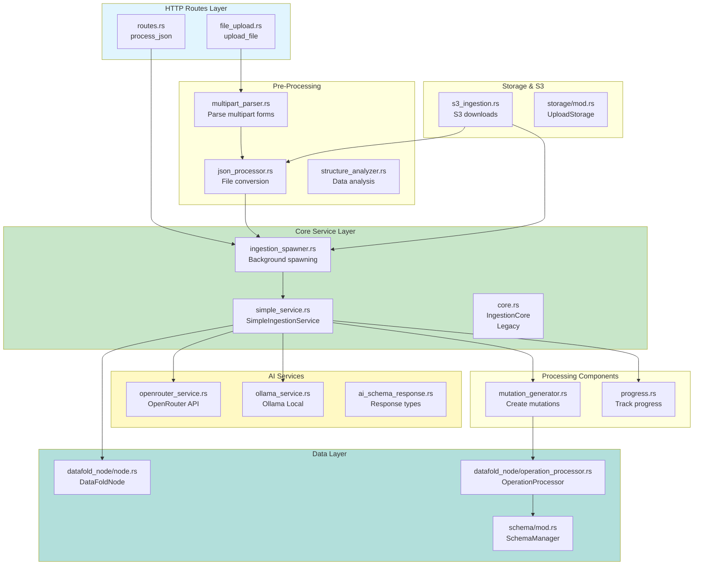

### Key Files & Responsibilities

| File | Lines | Responsibility |
|------|-------|----------------|
| **simple_service.rs** | 990 | Main ingestion orchestration, schema handling, mutation execution |
| **routes.rs** | ~150 | HTTP endpoints for JSON ingestion |
| **file_upload.rs** | 202 | File upload handling, multipart parsing coordination |
| **s3_ingestion.rs** | 317 | S3 file downloads and ingestion coordination |
| **mutation_generator.rs** | 182 | Transform JSON data into database mutations |
| **multipart_parser.rs** | ~200 | Parse multipart/form-data uploads |
| **json_processor.rs** | ~150 | Convert various file formats to JSON |
| **openrouter_service.rs** | ~300 | OpenRouter API integration |
| **ollama_service.rs** | ~300 | Ollama local model integration |
| **progress.rs** | ~250 | Real-time progress tracking |
| **ingestion_spawner.rs** | ~150 | Background task spawning |

---

## Progress Tracking System

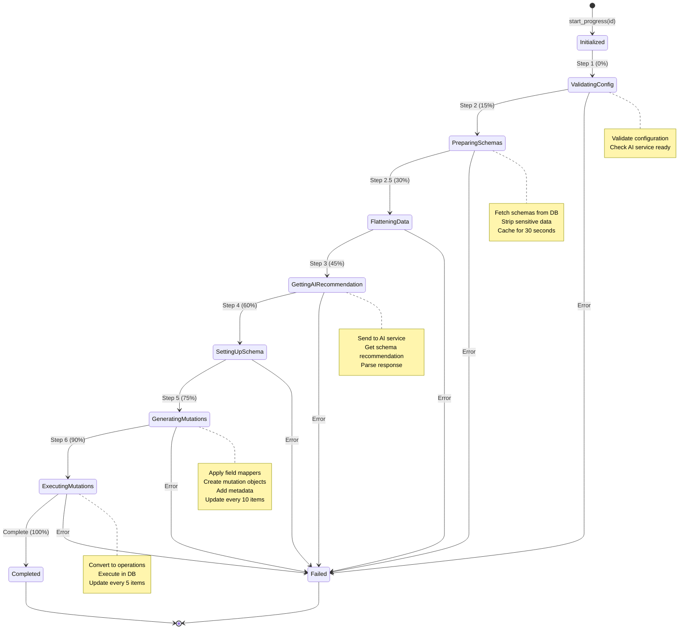

### Progress Response Structure

```json
{
  "progress_id": "550e8400-e29b-41d4-a716-446655440000",
  "current_step": "ExecutingMutations",
  "current_step_name": "Executing Mutations",
  "progress_percentage": 95,
  "message": "Executing mutations... (450/500)",
  "is_complete": false,
  "error_message": null,
  "results": null
}
```

### Client Polling Pattern

```javascript
async function waitForIngestion(progressId) {
  while (true) {
    const response = await fetch(`/api/ingestion/progress/${progressId}`);
    const progress = await response.json();
    
    // Update UI
    updateProgressBar(progress.progress_percentage);
    updateStatusMessage(progress.message);
    
    if (progress.is_complete) {
      if (progress.results) {
        console.log('Success:', progress.results);
        return progress.results;
      } else if (progress.error_message) {
        throw new Error(progress.error_message);
      }
    }
    
    // Poll every 500ms
    await new Promise(resolve => setTimeout(resolve, 500));
  }
}
```

---

## Schema Decision Tree

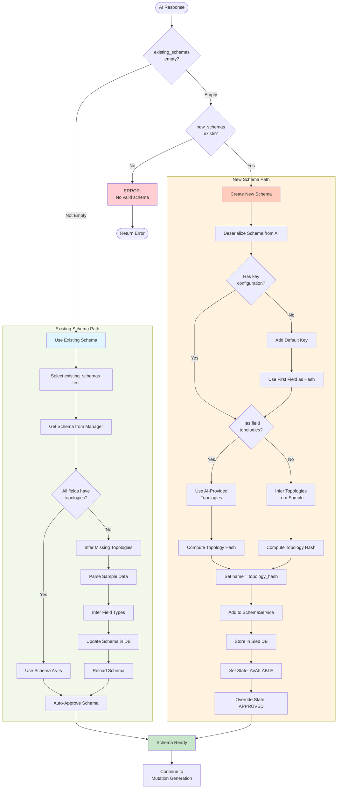

### Schema Topology Hash

The topology hash ensures structural deduplication:

```rust
// If two schemas have the same structure, they get the same name
let topology_hash = compute_hash(field_topologies);
schema.name = topology_hash;

// Example:
// Schema 1: {id: String, name: String, age: Number}
// Schema 2: {id: Text, name: Text, age: Integer}
// Both have same topology → same topology_hash → merged
```

---

## Mutation Generation

### Field Mapping Process

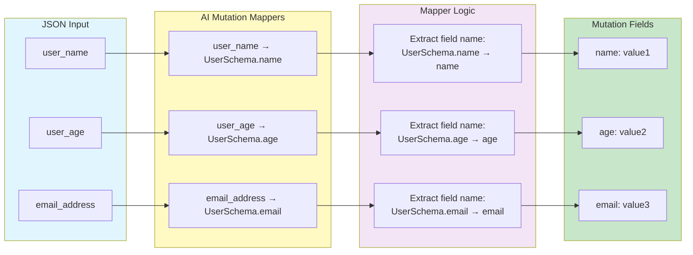

### Mutation Structure

```rust
pub struct Mutation {
    // Schema to insert into
    pub schema_name: String,
    
    // Fields and their values
    pub fields_and_values: HashMap<String, Value>,
    
    // Key configuration (hash and optional range)
    pub key_value: KeyValue,
    
    // Mutation type (Create, Update, Delete)
    pub mutation_type: MutationType,
    
    // Security and provenance
    pub trust_distance: u32,
    pub pub_key: String,
    
    // Source tracking
    pub source_file_name: Option<String>,
}
```

### Code Example

```rust
// From mutation_generator.rs
pub fn generate_mutations(
    &self,
    schema_name: &str,
    keys_and_values: &HashMap<String, String>,
    fields_and_values: &HashMap<String, Value>,
    mutation_mappers: &HashMap<String, String>,
    trust_distance: u32,
    pub_key: String,
    source_file_name: Option<String>,
) -> IngestionResult<Vec<Mutation>> {
    // Apply mappers to transform field names
    let mapped_fields = if mutation_mappers.is_empty() {
        // No mappers, use fields as-is
        fields_and_values.clone()
    } else {
        let mut result = HashMap::new();
        for (json_field, schema_field) in mutation_mappers {
            if let Some(value) = fields_and_values.get(json_field) {
                // Extract just the field name from "Schema.field"
                let field_name = schema_field.rsplit('.').next().unwrap_or(schema_field);
                result.insert(field_name.to_string(), value.clone());
            }
        }
        result
    };
    
    // Build KeyValue from keys
    let key_value = KeyValue::new(
        keys_and_values.get("hash_field").cloned(),
        keys_and_values.get("range_field").cloned(),
    );
    
    // Create mutation
    let mut mutation = Mutation::new(
        schema_name.to_string(),
        mapped_fields,
        key_value,
        pub_key,
        trust_distance,
        MutationType::Create,
    );
    
    if let Some(filename) = source_file_name {
        mutation = mutation.with_source_file_name(filename);
    }
    
    Ok(vec![mutation])
}
```

---

## Error Handling Strategy

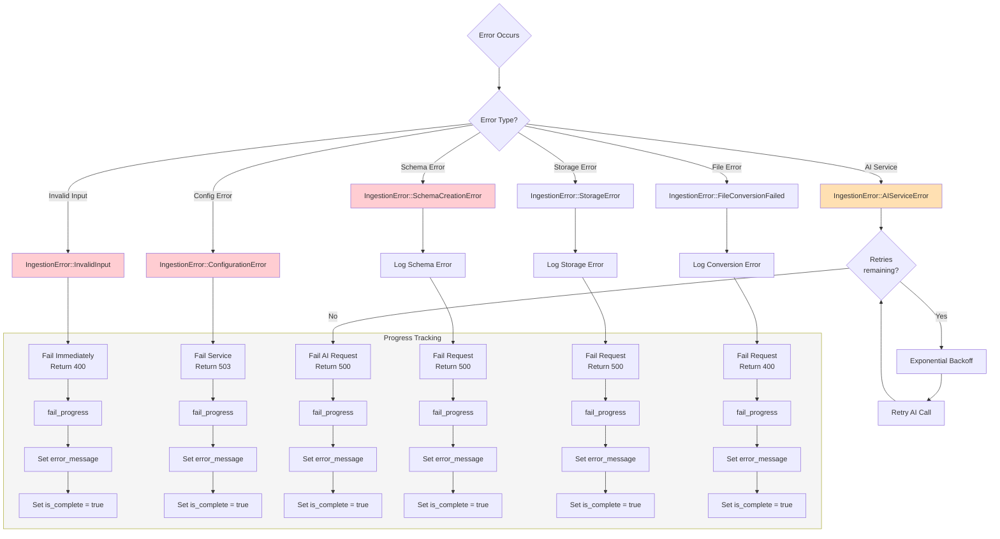

### Error Response Example

```json
{
  "progress_id": "550e8400-e29b-41d4-a716-446655440000",
  "current_step": "GettingAIRecommendation",
  "progress_percentage": 45,
  "is_complete": true,
  "error_message": "AI service timeout after 3 retries: connection refused",
  "results": null
}
```

### Retry Configuration

```rust
// From config.rs
pub struct IngestionConfig {
    pub max_retries: u32,              // Default: 3
    pub timeout_seconds: u64,          // Default: 60
    // ...
}

// Exponential backoff logic
let wait_time = 2u64.pow(retry_count) * 1000; // ms
tokio::time::sleep(Duration::from_millis(wait_time)).await;
```

---

## Examples & Usage

### 1. Direct JSON Ingestion (API)

```bash
curl -X POST http://localhost:9001/api/ingestion/process \
  -H "Content-Type: application/json" \
  -d '{
    "data": [
      {"id": "1", "name": "Alice", "age": 30},
      {"id": "2", "name": "Bob", "age": 25}
    ],
    "auto_execute": true,
    "trust_distance": 0,
    "pub_key": "default"
  }'

# Response:
{
  "success": true,
  "progress_id": "550e8400-e29b-41d4-a716-446655440000",
  "schema_used": null,
  "new_schema_created": false,
  "mutations_generated": 0,
  "mutations_executed": 0,
  "errors": []
}
```

### 2. File Upload

```bash
curl -X POST http://localhost:9001/api/ingestion/upload \
  -F "file=@data.json" \
  -F "autoExecute=true" \
  -F "trustDistance=0" \
  -F "pubKey=default"

# Response:
{
  "success": true,
  "progress_id": "7c9e6679-7425-40de-944b-e07fc1f90ae7",
  "message": "File upload and ingestion started...",
  "file_path": "/uploads/abc123_data.json",
  "duplicate": false
}
```

### 3. S3 Ingestion (Async)

```rust
use datafold::ingestion::{ingest_from_s3_path_async, S3IngestionRequest};

#[tokio::main]
async fn main() -> Result<(), Box<dyn std::error::Error>> {
    let upload_storage = UploadStorage::local("uploads".into());
    let progress_tracker = Arc::new(Mutex::new(HashMap::new()));
    let node = /* initialize DataFoldNode */;
    let ingestion_config = IngestionConfig::from_env()?;
    
    let request = S3IngestionRequest::new(
        "s3://my-bucket/data/users.json".to_string()
    ).with_auto_execute(true);
    
    let response = ingest_from_s3_path_async(
        &request,
        &upload_storage,
        &progress_tracker,
        node,
        &ingestion_config
    ).await?;
    
    println!("Ingestion started: {}", response.progress_id.unwrap());
    Ok(())
}
```

### 4. AWS Lambda Handler

```rust
use aws_lambda_events::event::s3::S3Event;
use lambda_runtime::{service_fn, Error, LambdaEvent};

async fn handler(event: LambdaEvent<S3Event>) -> Result<(), Error> {
    for record in event.payload.records {
        let bucket = record.s3.bucket.name.unwrap();
        let key = record.s3.object.key.unwrap();
        let s3_path = format!("s3://{}/{}", bucket, key);
        
        let request = S3IngestionRequest::new(s3_path)
            .with_auto_execute(true)
            .with_trust_distance(0);
        
        // Use sync version to wait for completion
        let response = ingest_from_s3_path_sync(
            &request,
            &upload_storage,
            &progress_tracker,
            node,
            &ingestion_config
        ).await?;
        
        println!("Ingested {} mutations", response.mutations_executed);
    }
    
    Ok(())
}

#[tokio::main]
async fn main() -> Result<(), Error> {
    lambda_runtime::run(service_fn(handler)).await
}
```

### 5. Progress Polling (JavaScript)

```javascript
async function ingestFile(file) {
  const formData = new FormData();
  formData.append('file', file);
  formData.append('autoExecute', 'true');
  
  // Upload file
  const uploadResponse = await fetch('/api/ingestion/upload', {
    method: 'POST',
    body: formData
  });
  
  const { progress_id } = await uploadResponse.json();
  
  // Poll for progress
  while (true) {
    await new Promise(resolve => setTimeout(resolve, 500));
    
    const progressResponse = await fetch(`/api/ingestion/progress/${progress_id}`);
    const progress = await progressResponse.json();
    
    // Update UI
    updateProgressBar(progress.progress_percentage);
    updateStatus(progress.message);
    
    if (progress.is_complete) {
      if (progress.results) {
        console.log('Success:', progress.results);
        return progress.results;
      } else if (progress.error_message) {
        throw new Error(progress.error_message);
      }
    }
  }
}
```

---

## Configuration

### Environment Variables

```bash
# AI Provider Selection
export AI_PROVIDER=openrouter              # or 'ollama'

# OpenRouter Configuration
export FOLD_OPENROUTER_API_KEY=sk-...     # Required for OpenRouter
export OPENROUTER_MODEL=anthropic/claude-3.5-sonnet
export OPENROUTER_BASE_URL=https://openrouter.ai/api/v1

# Ollama Configuration
export OLLAMA_MODEL=llama3                 # Default model
export OLLAMA_BASE_URL=http://localhost:11434

# Ingestion Settings
export INGESTION_ENABLED=true              # Enable/disable ingestion
export INGESTION_AUTO_EXECUTE=true         # Auto-execute mutations
export INGESTION_DEFAULT_TRUST_DISTANCE=0
export INGESTION_MAX_RETRIES=3             # AI service retries
export INGESTION_TIMEOUT_SECONDS=60        # AI service timeout

# S3 Configuration (if using S3 storage)
export AWS_ACCESS_KEY_ID=...
export AWS_SECRET_ACCESS_KEY=...
export AWS_REGION=us-east-1
export S3_BUCKET=my-data-bucket
```

### Config File

```json
{
  "provider": "openrouter",
  "openrouter": {
    "api_key": "sk-...",
    "model": "anthropic/claude-3.5-sonnet",
    "base_url": "https://openrouter.ai/api/v1"
  },
  "ollama": {
    "model": "llama3",
    "base_url": "http://localhost:11434"
  },
  "enabled": true,
  "auto_execute_mutations": true,
  "default_trust_distance": 0,
  "max_retries": 3,
  "timeout_seconds": 60
}
```

---

## Testing

### Run All Tests

```bash
# Backend tests
cargo test ingestion

# Run specific test
cargo test test_generate_mutations

# With logging
RUST_LOG=info cargo test ingestion -- --nocapture
```

### Manual Testing Flow

```bash
# 1. Start the server
./run_http_server.sh

# 2. Test direct JSON ingestion
curl -X POST http://localhost:9001/api/ingestion/process \
  -H "Content-Type: application/json" \
  -d '{
    "data": {"name": "Test", "value": 123},
    "auto_execute": true
  }' | jq

# 3. Get progress
PROGRESS_ID="<from-previous-response>"
curl http://localhost:9001/api/ingestion/progress/$PROGRESS_ID | jq

# 4. Test file upload
curl -X POST http://localhost:9001/api/ingestion/upload \
  -F "file=@test_data.json" \
  -F "autoExecute=true" | jq

# 5. Check ingestion status
curl http://localhost:9001/api/ingestion/status | jq
```

---

## Performance Considerations

### Caching Strategy

- **Schema Cache**: 30-second TTL in-memory cache
- **Progress Updates**: Every 5-10 items to reduce lock contention
- **Batch Mutations**: All mutations executed in a single batch

### Optimization Tips

1. **Large Files**: Process in chunks if memory is constrained
2. **Progress Updates**: Adjust frequency based on item count
3. **Schema Cache**: Increase TTL if schemas rarely change
4. **AI Timeouts**: Increase for complex data structures

### Benchmarks

| Operation | Time (avg) | Notes |
|-----------|-----------|-------|
| File Upload (1MB) | 200ms | Local storage |
| S3 Download (1MB) | 500ms | Depends on region |
| AI Schema Analysis | 2-5s | Depends on provider |
| Mutation Generation (1000 items) | 100ms | In-memory |
| Mutation Execution (1000 items) | 1-2s | Sled DB writes |

---

## Future Enhancements

- [ ] Streaming ingestion for large files
- [ ] Parallel mutation execution
- [ ] Schema versioning for AI-created schemas
- [ ] Custom AI prompts/templates
- [ ] Multi-schema mutations (related data)
- [ ] Ingestion audit log
- [ ] Webhook notifications on completion
- [ ] Resume failed ingestions
- [ ] Batch API for multiple files
- [ ] GraphQL ingestion endpoint

---

## Troubleshooting

### Common Issues

**Issue: "Ingestion module is not properly configured"**
- Check `AI_PROVIDER` environment variable
- Verify API keys are set correctly
- Check `INGESTION_ENABLED=true`

**Issue: "AI service timeout"**
- Increase `INGESTION_TIMEOUT_SECONDS`
- Check AI service is running (Ollama)
- Verify network connectivity (OpenRouter)

**Issue: "Schema creation failed"**
- Check schema definition from AI
- Verify sample data structure
- Check database permissions

**Issue: "File already exists"**
- This is expected for duplicate content
- Content-based deduplication is working
- No ingestion needed for duplicates

### Debug Logging

```bash
# Enable debug logs
RUST_LOG=datafold=debug ./run_http_server.sh

# Filter by feature
RUST_LOG=datafold::ingestion=trace ./run_http_server.sh

# View logs
tail -f server.log | grep -i ingestion
```

---

## Appendix: Data Flow Summary

```
┌─────────────┐
│   Client    │
└──────┬──────┘
       │
       ▼
┌─────────────────────────────┐
│  Entry Point                │
│  • API (JSON)               │
│  • File Upload              │
│  • S3 Path                  │
└──────┬──────────────────────┘
       │
       ▼
┌─────────────────────────────┐
│  Pre-Processing             │
│  • Parse/Convert            │
│  • Flatten Data             │
│  • Deduplication            │
└──────┬──────────────────────┘
       │
       ▼ (Background Task)
┌─────────────────────────────┐
│  Validation & Schemas       │
│  • Validate config          │
│  • Fetch schemas            │
│  • Strip sensitive data     │
│  • Cache (30s TTL)          │
└──────┬──────────────────────┘
       │
       ▼
┌─────────────────────────────┐
│  AI Analysis                │
│  • Send to AI service       │
│  • Get recommendation       │
│  • Parse response           │
└──────┬──────────────────────┘
       │
       ▼
┌─────────────────────────────┐
│  Schema Handling            │
│  • Use existing OR          │
│  • Create new schema        │
│  • Auto-approve             │
│  • Ensure topologies        │
└──────┬──────────────────────┘
       │
       ▼
┌─────────────────────────────┐
│  Mutation Generation        │
│  • Extract fields           │
│  • Apply mappers            │
│  • Add metadata             │
│  • Create mutations         │
└──────┬──────────────────────┘
       │
       ▼
┌─────────────────────────────┐
│  Execution (if auto_execute)│
│  • Convert to operations    │
│  • Execute batch            │
│  • Update indexes           │
│  • Track results            │
└──────┬──────────────────────┘
       │
       ▼
┌─────────────────────────────┐
│  Complete Progress          │
│  • Store results            │
│  • Set 100% complete        │
│  • Client polls for status  │
└─────────────────────────────┘
```

---

*Document Version: 1.0*  
*Last Updated: November 20, 2025*  
*Maintainer: FoldDB Team*

