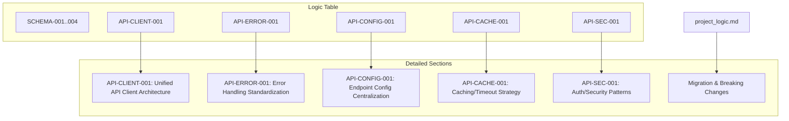

# TASK-010: Project Logic Documentation Update Plan

## Objective
Update `docs/project_logic.md` to reflect the new standardized API client architecture and all logical changes made during the API-STD-1 migration.

---

## 1. Update `docs/project_logic.md`

### Add New Logic IDs and Entries
- **API-CLIENT-001**: Unified API Client Architecture
- **API-ERROR-001**: Standardized Error Handling
- **API-CONFIG-001**: Centralized API Endpoint Configuration
- **API-CACHE-001**: API Caching and Timeout Strategy
- **API-SEC-001**: Authentication and Security Patterns

### Update Logic Table
- Insert new entries for each logic ID above.

### Add Detailed Sections
For each new logic entry, include:
- Description
- Rationale
- Rules
- Enforcement Points
- Implementation Notes

### Update or Cross-Reference Existing Logic
- Deprecate references to `httpClient.ts` and direct `fetch()` usage.
- Update any logic that now uses the new API clients.
- Ensure SCHEMA-002 and other schema logic remain accurate.
- Update cross-references as needed.

---

## 2. Document Breaking Changes & Migration

- Summarize the migration from `fetch()` to API clients.
- Note deprecation of `httpClient.ts`.
- Document architectural decisions and rationale.
- Reference [`docs/delivery/API-STD-1/migration-reference.md`](api-std-1/migration-reference.md).

---

## 3. Create TASK-010 Delivery Documentation

- Create `docs/delivery/API-STD-1/API-STD-1-TASK-010.md` summarizing:
  - The logic documentation updates
  - The new logic IDs and their purpose
  - The migration and breaking changes

---

## Mermaid Diagram: Logic Documentation Structure

---

## Summary

This plan ensures the project logic documentation is fully updated to reflect the new API client standardization, with clear logic IDs, detailed documentation, and a record of all architectural and migration changes.
