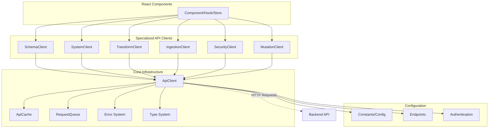

# API Client Architecture Documentation

**Version:** 1.0  
**Date:** June 28, 2025  
**Part of:** API-STD-1 Product Backlog Item  

## Overview

The Datafold API client architecture provides a unified, standardized approach to HTTP communication across the React frontend. This architecture implements DRY principles, consistent error handling, authentication management, caching strategies, and comprehensive type safety.

### Architecture Goals

- **DRY (Don't Repeat Yourself)**: Eliminate code duplication across API operations
- **Consistency**: Standardized request/response patterns and error handling
- **Type Safety**: Full TypeScript support with comprehensive interfaces
- **Security**: Built-in authentication and schema validation
- **Performance**: Intelligent caching, request deduplication, and batch operations
- **Reliability**: Retry logic, timeout management, and graceful error handling
- **Maintainability**: Modular design with clear separation of concerns

## Architecture Diagram



## Unified Core Client

### ApiClient Class

The [`ApiClient`](src/datafold_node/static-react/src/api/core/client.ts:134) class serves as the foundation for all API operations. It provides:

#### Core Features

- **HTTP Methods**: GET, POST, PUT, DELETE, PATCH with consistent interfaces
- **Request/Response Interceptors**: Middleware for modifying requests and responses
- **Error Interceptors**: Centralized error handling and transformation
- **Metrics Collection**: Performance monitoring and request tracking
- **Configuration Management**: Flexible configuration with sensible defaults

#### Key Capabilities

```typescript
// Basic HTTP operations
const response = await client.get<T>('/endpoint', options);
const response = await client.post<T>('/endpoint', data, options);

// Batch operations
const responses = await client.batch([
  { id: '1', method: 'GET', url: '/schemas' },
  { id: '2', method: 'GET', url: '/transforms' }
]);

// Cache management
const stats = client.getCacheStats();
client.clearCache();

// Metrics access
const metrics = client.getMetrics();
```

### ApiCache Class

The [`ApiCache`](src/datafold_node/static-react/src/api/core/client.ts:54) class implements intelligent caching:

#### Features

- **LRU Eviction**: Least Recently Used cache eviction policy
- **TTL Support**: Time-to-live with automatic expiration
- **Hit Rate Tracking**: Performance monitoring
- **Configurable Size**: Maximum cache size limits

#### Cache Strategy

- **GET Requests**: Automatically cached unless `cacheable: false`
- **Cache Keys**: Generated from URL and headers for uniqueness
- **TTL Configuration**: Operation-specific timeouts from [`constants/api.ts`](src/datafold_node/static-react/src/constants/api.ts:44)
- **Cache Invalidation**: Automatic on expiration or manual clearing

### RequestQueue Class

The [`RequestQueue`](src/datafold_node/static-react/src/api/core/client.ts:107) class prevents duplicate requests:

#### Features

- **Request Deduplication**: Identical concurrent requests share responses
- **Queue Management**: Automatic cleanup on completion
- **Performance Optimization**: Reduces server load and improves response times

## Specialized Clients

### Schema Client

**File:** [`clients/schemaClient.ts`](src/datafold_node/static-react/src/api/clients/schemaClient.ts:33)  
**Purpose:** Schema management and SCHEMA-002 compliance

#### Key Methods

```typescript
const schemaClient = new UnifiedSchemaClient();

// Core operations
await schemaClient.getSchemas();                    // Get all schemas
await schemaClient.getSchema(name);                 // Get specific schema
await schemaClient.getSchemasByState(state);        // Filter by state
await schemaClient.getSchemaStatus();               // Get status overview

// State management
await schemaClient.approveSchema(name);             // Approve schema
await schemaClient.blockSchema(name);               // Block schema
await schemaClient.loadSchema(name);                // Load into memory
await schemaClient.unloadSchema(name);              // Unload from memory

// Validation
await schemaClient.validateSchemaForOperation(name, operation);
```

#### Features

- **SCHEMA-002 Compliance**: Enforces approved-only access
- **State Management**: Schema approval, blocking, loading/unloading
- **Batch Operations**: Efficient handling of multiple schemas
- **Validation**: Client-side and server-side validation

### Security Client

**File:** [`clients/securityClient.ts`](src/datafold_node/static-react/src/api/clients/securityClient.ts:49)  
**Purpose:** Authentication, key management, and cryptographic operations

#### Key Methods

```typescript
const securityClient = new UnifiedSecurityClient();

// Verification operations
await securityClient.verifyMessage(signedMessage);          // Verify signatures
await securityClient.getSystemPublicKey();                  // Get system key

// Key management
await securityClient.registerPublicKey(request);            // Register new key
await securityClient.getSecurityStatus();                   // Security status

// Validation helpers
securityClient.validatePublicKeyFormat(publicKey);          // Format validation
securityClient.validateSignedMessage(signedMessage);        // Message validation
```

#### Features

- **Ed25519 Support**: Cryptographic key validation
- **Message Verification**: Signature validation with caching
- **Key Registration**: Public key management
- **Security Status**: System security monitoring

### System Client

**File:** [`clients/systemClient.ts`](src/datafold_node/static-react/src/api/clients/systemClient.ts:55)  
**Purpose:** System operations, logging, and database management

#### Key Methods

```typescript
const systemClient = new UnifiedSystemClient();

// System operations
await systemClient.getSystemStatus();                       // System health
await systemClient.getLogs();                               // System logs
await systemClient.resetDatabase(confirm);                  // Database reset

// Utilities
systemClient.createLogStream(callback);                     // Real-time logs
systemClient.validateResetRequest(request);                 // Request validation
```

#### Features

- **System Monitoring**: Health status and metrics
- **Log Management**: Access and streaming capabilities
- **Database Operations**: Reset and maintenance operations
- **Validation**: Request validation and safety checks

### Transform Client

**File:** [`clients/transformClient.ts`](src/datafold_node/static-react/src/api/clients/transformClient.ts:54)  
**Purpose:** Data transformation and queue management

#### Key Methods

```typescript
const transformClient = new UnifiedTransformClient();

// Transform operations
await transformClient.getTransforms();                      // List transforms
await transformClient.getTransform(id);                     // Get specific transform
await transformClient.getQueue();                           // Queue status

// Queue management
await transformClient.addToQueue(transformId);              // Add to queue
await transformClient.removeFromQueue(transformId);         // Remove from queue

// Validation
transformClient.validateTransformId(id);                    // ID validation
```

#### Features

- **Transform Management**: CRUD operations for data transformations
- **Queue Operations**: Transform execution queue management
- **Validation**: Transform ID and request validation
- **Metrics**: Queue performance and status tracking

### Ingestion Client

**File:** [`clients/ingestionClient.ts`](src/datafold_node/static-react/src/api/clients/ingestionClient.ts:73)  
**Purpose:** AI-powered data ingestion and schema generation

#### Key Methods

```typescript
const ingestionClient = new UnifiedIngestionClient();

// Ingestion operations
await ingestionClient.getStatus();                          // Service status
await ingestionClient.validateData(data);                   // Data validation
await ingestionClient.processIngestion(data, options);      // AI processing

// Configuration
await ingestionClient.getConfig();                          // OpenRouter config
await ingestionClient.saveConfig(config);                   // Save config

// Validation helpers
ingestionClient.validateOpenRouterConfig(config);           // Config validation
ingestionClient.validateIngestionRequest(request);          // Request validation
```

#### Features

- **AI Integration**: OpenRouter API integration for schema generation
- **Data Validation**: Structure and format validation
- **Configuration Management**: AI model and API key management
- **Extended Timeouts**: Support for long-running AI operations (60+ seconds)

### Mutation Client

**File:** [`clients/mutationClient.ts`](src/datafold_node/static-react/src/api/clients/mutationClient.ts)  
**Purpose:** Data mutation operations and query execution

#### Features

- **Mutation Operations**: Data modification with authentication
- **Query Execution**: Parameterized query support
- **Validation**: Mutation and query validation
- **Authentication**: Required for all mutation operations

## Authentication and Security Patterns

### Authentication Flow

1. **Auth State Management**: Redux store maintains authentication state
2. **Automatic Headers**: [`addAuthHeaders`](src/datafold_node/static-react/src/api/core/client.ts:480) adds authentication automatically
3. **Signed Requests**: Cryptographic signing for mutation operations
4. **Schema Validation**: SCHEMA-002 compliance for approved-only access

### Security Features

- **Request Signing**: Cryptographic signatures for sensitive operations
- **Public Key Management**: Ed25519 key registration and validation
- **Authentication Required**: Configurable per-request authentication
- **Schema State Validation**: Prevents unauthorized schema access

### Configuration

```typescript
// Authentication configuration
const options: RequestOptions = {
  requiresAuth: true,           // Require authentication
  validateSchema: {             // Schema validation options
    requiresApproved: true,
    operation: 'mutation',
    schemaName: 'users'
  }
};
```

## Error Handling Standardization

### Error Class Hierarchy

The error system in [`core/errors.ts`](src/datafold_node/static-react/src/api/core/errors.ts:15) provides comprehensive error handling:

#### Base Classes

- **[`ApiError`](src/datafold_node/static-react/src/api/core/errors.ts:15)**: Base error class with enhanced functionality
- **[`NetworkError`](src/datafold_node/static-react/src/api/core/errors.ts:159)**: Network connectivity issues
- **[`TimeoutError`](src/datafold_node/static-react/src/api/core/errors.ts:174)**: Request timeout errors
- **[`AuthenticationError`](src/datafold_node/static-react/src/api/core/errors.ts:119)**: Authentication failures
- **[`SchemaStateError`](src/datafold_node/static-react/src/api/core/errors.ts:133)**: Schema state violations
- **[`ValidationError`](src/datafold_node/static-react/src/api/core/errors.ts:193)**: Request validation failures
- **[`RateLimitError`](src/datafold_node/static-react/src/api/core/errors.ts:212)**: Rate limiting errors

#### Error Features

```typescript
// Error properties
interface ApiError {
  status: number;                    // HTTP status code
  isNetworkError: boolean;          // Network connectivity issue
  isTimeoutError: boolean;          // Request timeout
  isRetryable: boolean;             // Can retry this error
  requestId?: string;               // Request tracking ID
  timestamp: number;                // Error timestamp
  code?: string;                    // Error code
  details?: Record<string, any>;    // Additional details
}

// Error methods
error.toUserMessage();              // User-friendly message
error.toJSON();                     // Serialization for logging
```

#### Error Factory

The [`ErrorFactory`](src/datafold_node/static-react/src/api/core/errors.ts:234) creates appropriate error instances:

```typescript
// Automatic error creation
const error = await ErrorFactory.fromResponse(response, requestId);
const networkError = ErrorFactory.fromNetworkError(error, requestId);
const timeoutError = ErrorFactory.fromTimeout(timeoutMs, requestId);
```

### Error Handling Patterns

```typescript
try {
  const response = await client.get('/endpoint');
  return response.data;
} catch (error) {
  if (isAuthenticationError(error)) {
    // Handle auth failure
    redirectToLogin();
  } else if (isNetworkError(error)) {
    // Handle network issues
    showNetworkErrorMessage();
  } else if (isRetryableError(error)) {
    // Handle retryable errors
    scheduleRetry();
  } else {
    // Handle other errors
    showGenericError(error.toUserMessage());
  }
}
```

## Caching and Timeout Strategies

### Cache Configuration

Caching strategies are defined in [`constants/api.ts`](src/datafold_node/static-react/src/constants/api.ts:44):

#### TTL Configuration

```typescript
export const API_CACHE_TTL = {
  IMMEDIATE: 30000,          // 30 seconds - system status
  SHORT: 60000,              // 1 minute - queries, schema status
  MEDIUM: 180000,            // 3 minutes - schema state, transforms
  STANDARD: 300000,          // 5 minutes - schemas, mutation history
  LONG: 3600000,             // 1 hour - system public key
  
  // Semantic aliases
  SYSTEM_STATUS: 30000,
  QUERY_RESULTS: 60000,
  SCHEMA_DATA: 300000,
  SYSTEM_PUBLIC_KEY: 3600000,
  VERIFICATION_RESULTS: 300000
};
```

#### Cache Strategies by Operation

- **System Status**: 30 seconds (frequently changing)
- **Query Results**: 1 minute (moderate caching)
- **Schema Data**: 5 minutes (stable data)
- **System Public Key**: 1 hour (rarely changes)
- **Mutations**: No caching (never cache mutations)

### Timeout Configuration

Operation-specific timeouts optimize performance and user experience:

#### Timeout Categories

```typescript
export const API_TIMEOUTS = {
  QUICK: 5000,               // System status, basic gets
  STANDARD: 8000,            // Schema reads, transforms, logs
  CONFIG: 10000,             // Config changes, state changes
  MUTATION: 15000,           // Mutations, parameterized queries
  BATCH: 30000,              // Batch operations, database reset
  AI_PROCESSING: 60000,      // Extended AI processing operations
};
```

#### Timeout Strategy

- **Quick Operations**: 5 seconds for status checks
- **Standard Operations**: 8 seconds for most reads
- **Configuration Changes**: 10 seconds for state modifications
- **Mutations**: 15 seconds for data modifications
- **AI Processing**: 60 seconds for complex AI operations

### Retry Configuration

Intelligent retry strategies balance reliability and performance:

#### Retry Settings

```typescript
export const API_RETRIES = {
  NONE: 0,                   // Mutations, destructive operations
  LIMITED: 1,                // State changes, config operations
  STANDARD: 2,               // Most read operations
  CRITICAL: 3,               // System status, critical data
};

export const RETRY_CONFIG = {
  RETRYABLE_STATUS_CODES: [408, 429, 500, 502, 503, 504],
  EXPONENTIAL_BACKOFF_MULTIPLIER: 2,
  MAX_RETRY_DELAY_MS: 10000
};
```

#### Retry Logic

- **Exponential Backoff**: Delays increase exponentially (1s, 2s, 4s, ...)
- **Status Code Filtering**: Only retry specific HTTP status codes
- **Operation-Specific**: Different retry counts based on operation type
- **Maximum Delay**: Cap retry delays at 10 seconds

## Configuration Management

### Centralized Constants

All configuration is centralized in [`constants/api.ts`](src/datafold_node/static-react/src/constants/api.ts):

#### Key Configuration Areas

- **Base URLs**: API endpoint prefixes
- **HTTP Status Codes**: Standardized status code constants
- **Content Types**: Request/response content types
- **Request Headers**: Standard header names
- **Error Messages**: User-friendly error messages
- **Cache Settings**: TTL and size limits
- **Schema Constants**: SCHEMA-002 compliance settings

### Endpoint Management

API endpoints are centralized in [`endpoints.ts`](src/datafold_node/static-react/src/api/endpoints.ts):

```typescript
export const API_ENDPOINTS = {
  // Security endpoints
  VERIFY_MESSAGE: '/security/verify-message',
  REGISTER_PUBLIC_KEY: '/security/system-key',
  GET_SYSTEM_PUBLIC_KEY: '/security/system-key',
  
  // Schema endpoints
  SCHEMAS_BASE: '/schemas',
  SCHEMA_BY_NAME: (name: string) => `/schemas/${name}`,
  SCHEMA_APPROVE: (name: string) => `/schemas/${name}/approve`,
  
  // System endpoints
  SYSTEM_STATUS: '/system/status',
  SYSTEM_CONFIG: '/system/config',
};
```

## Type Safety

### TypeScript Integration

Comprehensive type definitions in [`core/types.ts`](src/datafold_node/static-react/src/api/core/types.ts):

#### Key Interfaces

- **[`EnhancedApiResponse<T>`](src/datafold_node/static-react/src/api/core/types.ts:27)**: Standardized response format
- **[`RequestOptions`](src/datafold_node/static-react/src/api/core/types.ts:39)**: Request configuration options
- **[`ApiClientConfig`](src/datafold_node/static-react/src/api/core/types.ts:53)**: Client configuration
- **[`RequestMetrics`](src/datafold_node/static-react/src/api/core/types.ts:119)**: Performance metrics
- **[`BatchRequest`](src/datafold_node/static-react/src/api/core/types.ts:133)**: Batch operation support

#### Domain-Specific Types

Each specialized client includes comprehensive type definitions:

- **Schema Types**: Schema data, state, and status interfaces
- **Security Types**: Key data, verification, and authentication
- **System Types**: Logs, status, and configuration
- **Transform Types**: Transform data and queue information
- **Ingestion Types**: AI configuration and processing results

## Performance Optimizations

### Request Deduplication

The [`RequestQueue`](src/datafold_node/static-react/src/api/core/client.ts:107) prevents duplicate concurrent requests:

```typescript
// Multiple components requesting the same data simultaneously
// Only one actual HTTP request is made, response is shared
const response1 = client.get('/schemas');
const response2 = client.get('/schemas'); // Shares response from first request
```

### Batch Operations

The core client supports batch operations for efficiency:

```typescript
const batchRequests = [
  { id: 'schemas', method: 'GET', url: '/schemas' },
  { id: 'status', method: 'GET', url: '/system/status' },
  { id: 'transforms', method: 'GET', url: '/transforms' }
];

const results = await client.batch(batchRequests);
```

### Intelligent Caching

- **Automatic Cache Keys**: Generated from URL and headers
- **Cache Hit Tracking**: Performance monitoring
- **TTL Management**: Automatic expiration and cleanup
- **Memory Management**: LRU eviction prevents memory leaks

## Extensibility

### Adding New Clients

To add a new specialized client:

1. **Create Client Class**: Extend the pattern of `Unified*Client`
2. **Define Types**: Add TypeScript interfaces for requests/responses
3. **Configure Constants**: Add timeouts, retries, and cache settings
4. **Add Endpoints**: Define API endpoints in `endpoints.ts`
5. **Export from Index**: Add exports to `clients/index.ts`

### Adding New Operations

To add operations to existing clients:

1. **Add Method**: Implement method in appropriate client class
2. **Add Types**: Define request/response interfaces
3. **Add Validation**: Client-side validation helpers
4. **Add Tests**: Unit and integration tests
5. **Update Documentation**: Add usage examples

## Monitoring and Debugging

### Metrics Collection

The core client automatically collects performance metrics:

```typescript
interface RequestMetrics {
  requestId: string;
  url: string;
  method: HttpMethod;
  startTime: number;
  endTime: number;
  duration: number;
  status: number;
  cached: boolean;
  retryCount?: number;
  error?: string;
}
```

### Debug Information

- **Request IDs**: Unique tracking for every request
- **Timestamp Tracking**: Request timing information
- **Cache Statistics**: Hit rates and performance data
- **Error Context**: Detailed error information with context

### Performance Monitoring

```typescript
// Get performance metrics
const metrics = client.getMetrics();
const cacheStats = client.getCacheStats();

// Domain-specific metrics
const schemaMetrics = schemaClient.getMetrics();
const securityMetrics = securityClient.getMetrics();
```

## Migration Benefits

The unified API client architecture provides significant improvements over direct `fetch()` usage:

### Before (Direct fetch)
```typescript
// Repeated boilerplate code
const response = await fetch('/api/schemas', {
  method: 'GET',
  headers: {
    'Content-Type': 'application/json',
    'Authorization': `Bearer ${token}`
  }
});

if (!response.ok) {
  // Manual error handling
  throw new Error(`HTTP ${response.status}`);
}

const data = await response.json();
```

### After (Unified Client)
```typescript
// Clean, standardized interface
const response = await schemaClient.getSchemas();

// Automatic error handling, caching, retries, and type safety
if (response.success) {
  const schemas = response.data; // Fully typed
}
```

## Conclusion

The Datafold API client architecture provides a robust, scalable foundation for frontend-backend communication. By centralizing common functionality, enforcing consistent patterns, and providing comprehensive type safety, it significantly improves developer productivity, code maintainability, and application reliability.

The architecture's modular design supports easy extension and customization while maintaining backward compatibility and consistent behavior across all API operations.