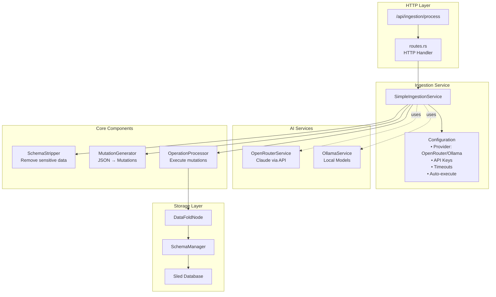
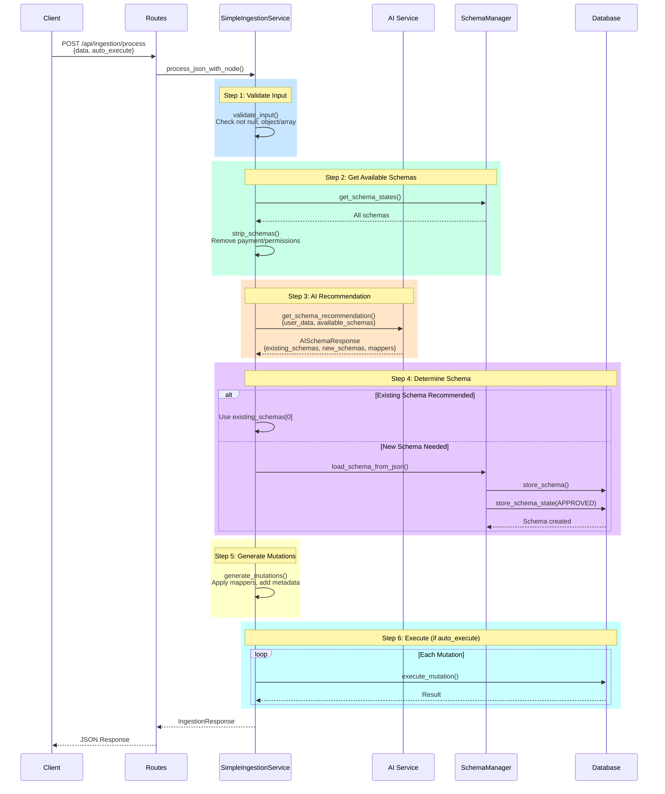
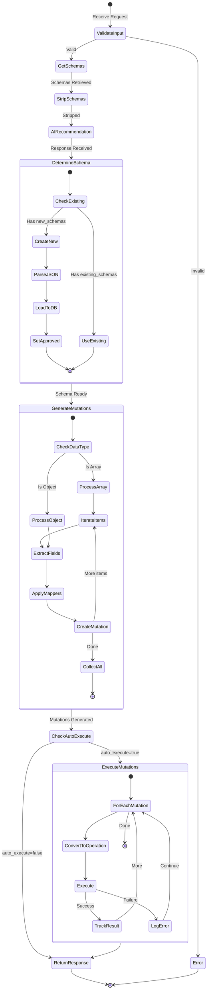
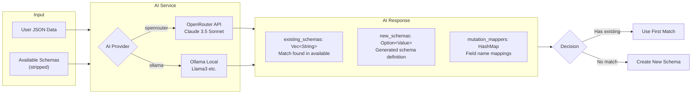
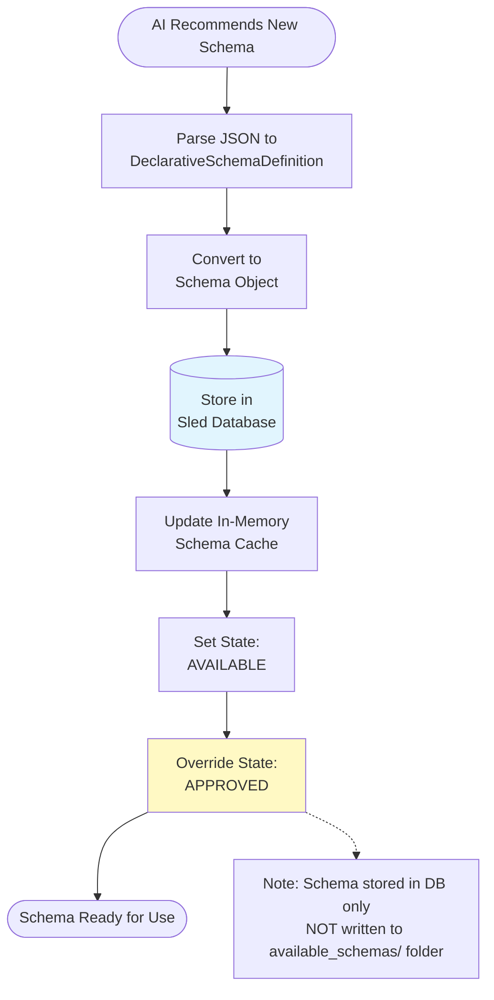
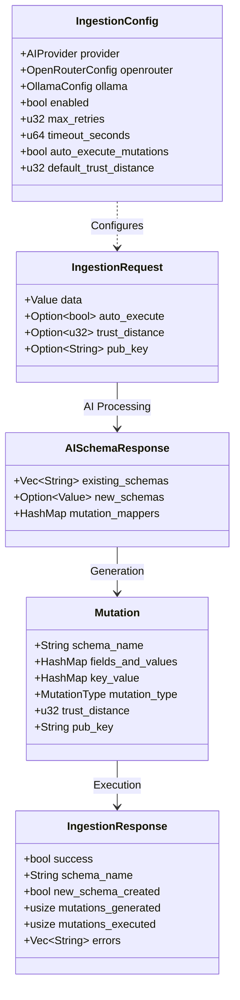
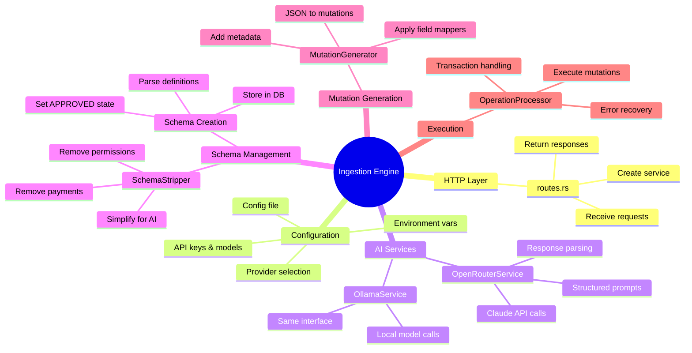
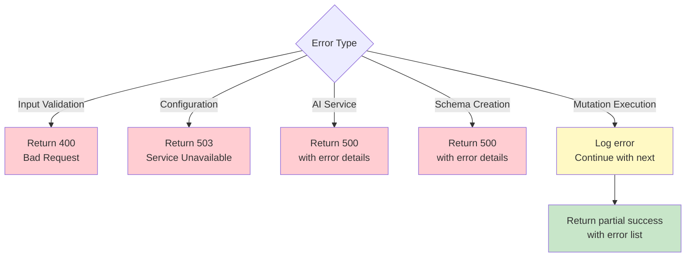

# Ingestion Engine Documentation

## Overview

The ingestion engine is an AI-powered system that automatically processes arbitrary JSON data, determines appropriate schemas, and generates database mutations. It supports both schema selection from existing schemas and automatic schema creation.

## Architecture



## Processing Flow



## Detailed Step Flow



## AI Schema Recommendation



## Schema Creation Process



## Data Structures



## Component Responsibilities



## Configuration

### Environment Variables

| Variable | Default | Description |
|----------|---------|-------------|
| `AI_PROVIDER` | `openrouter` | AI provider: `openrouter` or `ollama` |
| `FOLD_OPENROUTER_API_KEY` | - | OpenRouter API key (required for OpenRouter) |
| `OPENROUTER_MODEL` | `anthropic/claude-3.5-sonnet` | Model to use with OpenRouter |
| `OPENROUTER_BASE_URL` | `https://openrouter.ai/api/v1` | OpenRouter API endpoint |
| `OLLAMA_MODEL` | `llama3` | Ollama model name |
| `OLLAMA_BASE_URL` | `http://localhost:11434` | Ollama service endpoint |
| `INGESTION_ENABLED` | `true` | Enable/disable ingestion |
| `INGESTION_AUTO_EXECUTE` | `true` | Auto-execute mutations |
| `INGESTION_DEFAULT_TRUST_DISTANCE` | `0` | Default trust distance for mutations |
| `INGESTION_MAX_RETRIES` | `3` | Max retries for AI API calls |
| `INGESTION_TIMEOUT_SECONDS` | `60` | Timeout for AI API calls |

### Config File

Location: `./config/ingestion_config.json`

```json
{
  "provider": "openrouter",
  "openrouter": {
    "api_key": "sk-...",
    "model": "anthropic/claude-3.5-sonnet",
    "base_url": "https://openrouter.ai/api/v1"
  },
  "ollama": {
    "model": "llama3",
    "base_url": "http://localhost:11434"
  }
}
```

## API Endpoints

### Process Ingestion

**POST** `/api/ingestion/process`

Request:
```json
{
  "data": {
    "title": "Example",
    "content": "Data to ingest"
  },
  "auto_execute": true,
  "trust_distance": 0,
  "pub_key": "optional-key"
}
```

Response:
```json
{
  "success": true,
  "schema_name": "ExampleSchema",
  "new_schema_created": false,
  "mutations_generated": 1,
  "mutations_executed": 1,
  "errors": []
}
```

### Get Status

**GET** `/api/ingestion/status`

Response:
```json
{
  "enabled": true,
  "configured": true,
  "provider": "OpenRouter",
  "model": "anthropic/claude-3.5-sonnet",
  "auto_execute_mutations": true,
  "default_trust_distance": 0
}
```

### Health Check

**GET** `/api/ingestion/health`

Response:
```json
{
  "status": "healthy",
  "service": "ingestion",
  "details": { ... }
}
```

### Get/Save Config

**GET** `/api/ingestion/config`  
**POST** `/api/ingestion/config`

### Validate JSON

**POST** `/api/ingestion/validate`

## Error Handling



### Error Recovery

- **Input validation errors**: Fail immediately, return error to client
- **AI service errors**: Retry with exponential backoff (configurable), then fail
- **Schema creation errors**: Fail the request, return detailed error
- **Mutation execution errors**: Log error, continue with remaining mutations
- **Partial success**: Return success=true with error list for failed mutations

## Implementation Notes

### Schema Storage

- Schemas created by ingestion are stored in the **Sled database**
- They are **NOT** written to the `available_schemas/` folder
- Schemas persist across restarts (database is durable)
- To export a schema to file, use the schema management APIs

### Schema State Lifecycle

1. AI creates new schema → Stored as `AVAILABLE`
2. Immediately changed to `APPROVED` (auto-approval for ingestion)
3. Schema is now usable for mutations
4. On restart: Schema loads from database with `APPROVED` state

### Mutation Generation

- Single objects → 1 mutation
- Arrays → 1 mutation per item
- Field mappers from AI applied to handle field name variations
- Trust distance and pub_key added for security/provenance

### AI Integration

The AI is given:
- User's JSON data
- Stripped versions of available schemas (no payment/permission info)

The AI returns:
- List of matching existing schemas (empty if no match)
- New schema definition (if no existing schema fits)
- Field name mappings (AI data field → schema field)

## Testing

Example test flow:

```bash
# 1. Configure ingestion
curl -X POST http://localhost:8080/api/ingestion/config \
  -H "Content-Type: application/json" \
  -d '{
    "provider": "openrouter",
    "openrouter": {
      "api_key": "sk-...",
      "model": "anthropic/claude-3.5-sonnet"
    }
  }'

# 2. Process data
curl -X POST http://localhost:8080/api/ingestion/process \
  -H "Content-Type: application/json" \
  -d '{
    "data": {
      "title": "My Blog Post",
      "body": "Content here",
      "tags": ["tech", "ai"]
    },
    "auto_execute": true
  }'

# 3. Check status
curl http://localhost:8080/api/ingestion/status
```

## Future Enhancements

- [ ] Export ingestion-created schemas to `available_schemas/` folder
- [ ] Batch ingestion for multiple JSON objects
- [ ] Schema versioning for AI-created schemas
- [ ] Custom AI prompts/templates
- [ ] Schema suggestion feedback loop
- [ ] Multi-schema mutations (for related data)
- [ ] Async ingestion with job queue
- [ ] Ingestion audit log

