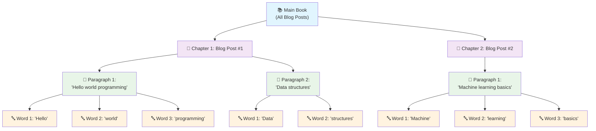
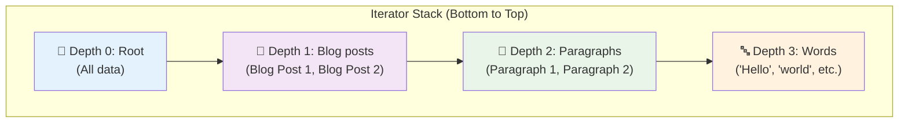
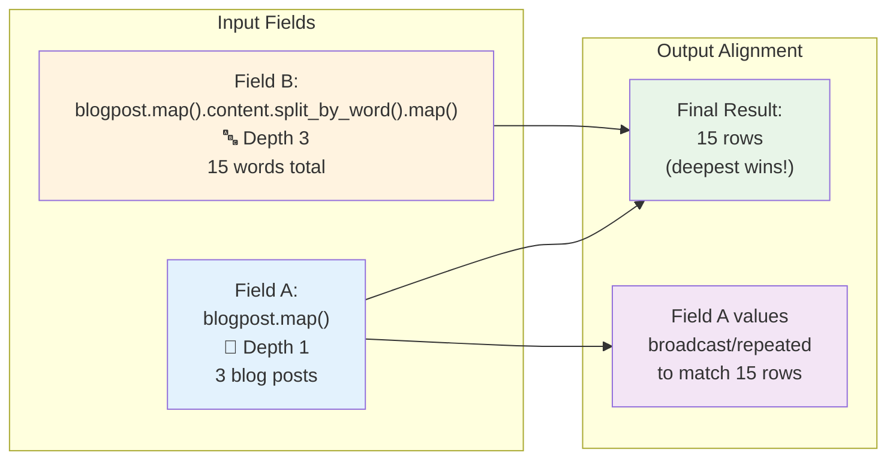
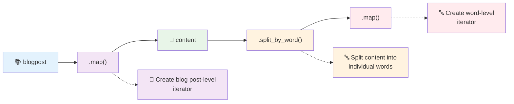
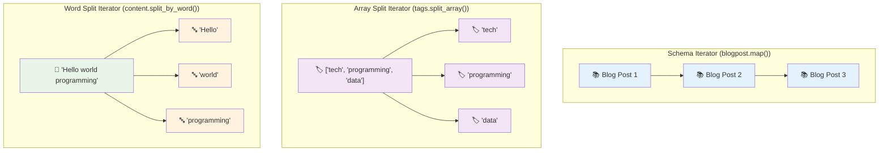
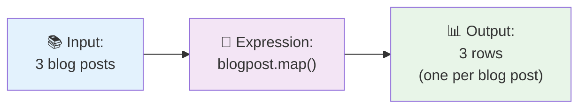
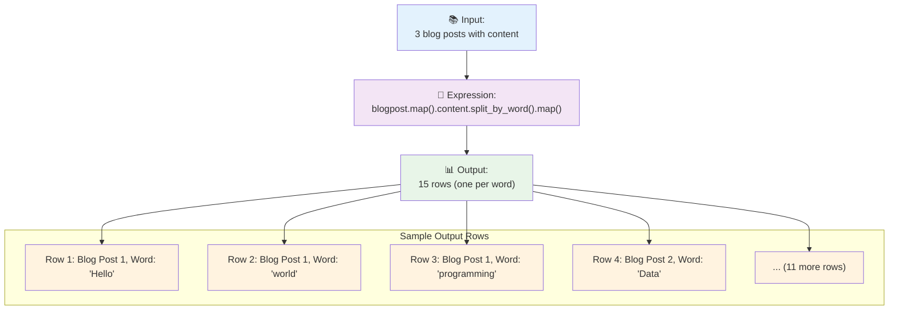
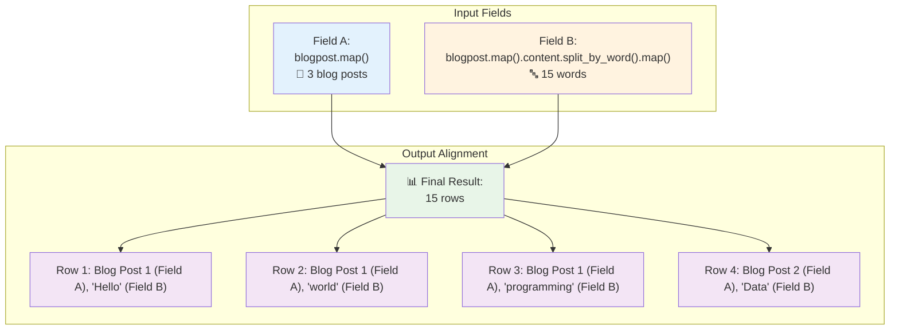
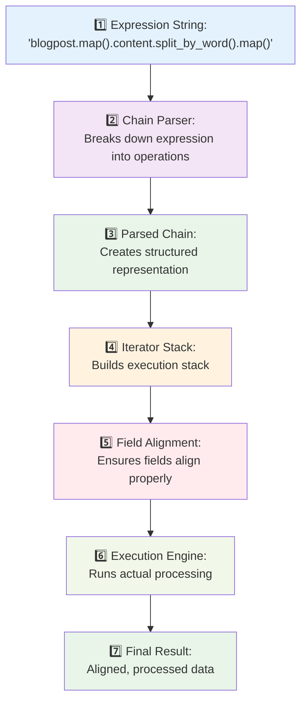
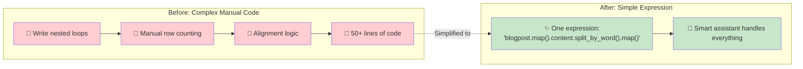

# Iterator Stack Explained (ELI5)

## What is the Iterator Stack? 🤔

Imagine you're reading a book with nested stories. The Iterator Stack is like a **bookmark system** that helps you keep track of where you are in each story level. Just like how you might have bookmarks for:
- The main story (depth 0)
- A story within the story (depth 1) 
- A story within that story (depth 2)

The Iterator Stack does the same thing for data processing!

## The Real-World Analogy 📚

Think of it like this:

The Iterator Stack helps you navigate through these nested levels systematically.

## How It Works 🔧

### 1. **Stack-Based Execution** (Like Russian Nesting Dolls)
Each level of iteration is like a nesting doll that sits inside the previous one:

### 2. **Depth-Determined Output** (The Deepest Wins)
The **deepest** iterator determines how many rows you get in your final result:

### 3. **Chain Syntax** (The Instructions)
You tell the system what to do using a chain of commands:

## Types of Iterators 🎯

## Real Examples 💡

### Example 1: Simple Blog Post Iteration

### Example 2: Word-Level Processing

### Example 3: Mixed Field Alignment

## Key Benefits ✨

### 1. **Flexible Data Processing**
- Handle complex nested data structures
- Process data at different levels simultaneously
- Mix different types of iterations

### 2. **Automatic Alignment**
- Fields automatically align to the deepest iterator
- No manual row counting or alignment needed
- Values broadcast intelligently

### 3. **Performance Optimized**
- Deduplication prevents redundant work
- Lazy evaluation only processes what's needed
- Memory-efficient streaming for large datasets

## The Execution Flow 🔄

## Why This Matters 🎯

The Iterator Stack makes complex data transformations **declarative** and **automatic**. Instead of writing complex nested loops and manual alignment code, you just describe what you want:

It's like having a smart assistant that understands exactly how to process your nested data without you having to micromanage every step!

## Summary 📝

The Iterator Stack is a **smart bookmark system** for nested data processing that:
- Keeps track of multiple levels of iteration simultaneously
- Automatically aligns fields to the deepest iteration level  
- Broadcasts values intelligently across iterations
- Makes complex data transformations simple and declarative

It's the engine that powers FoldDB's ability to handle complex, nested data transformations with ease! 🚀
