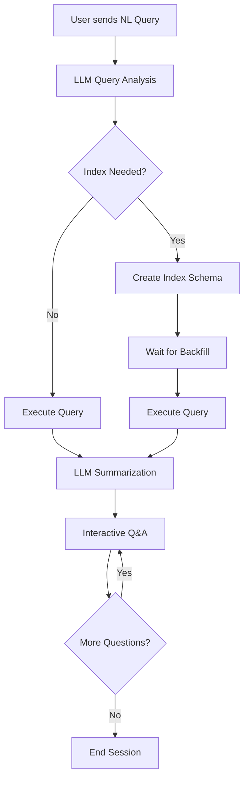
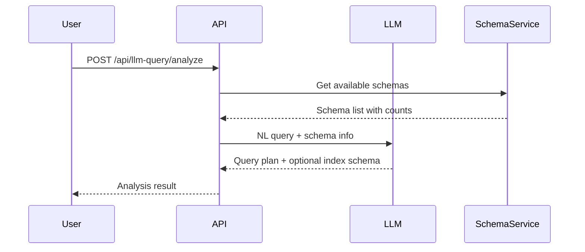
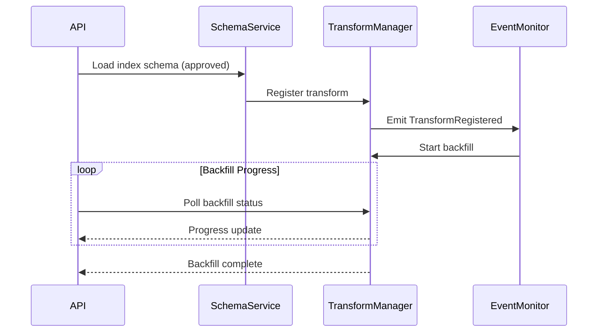
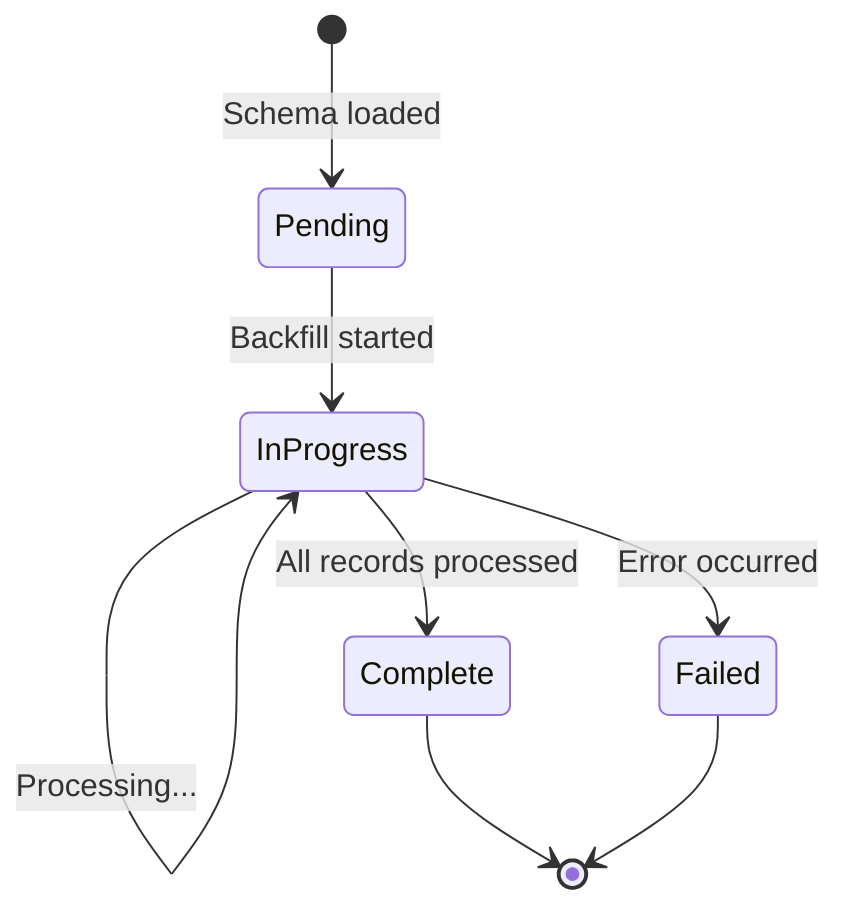
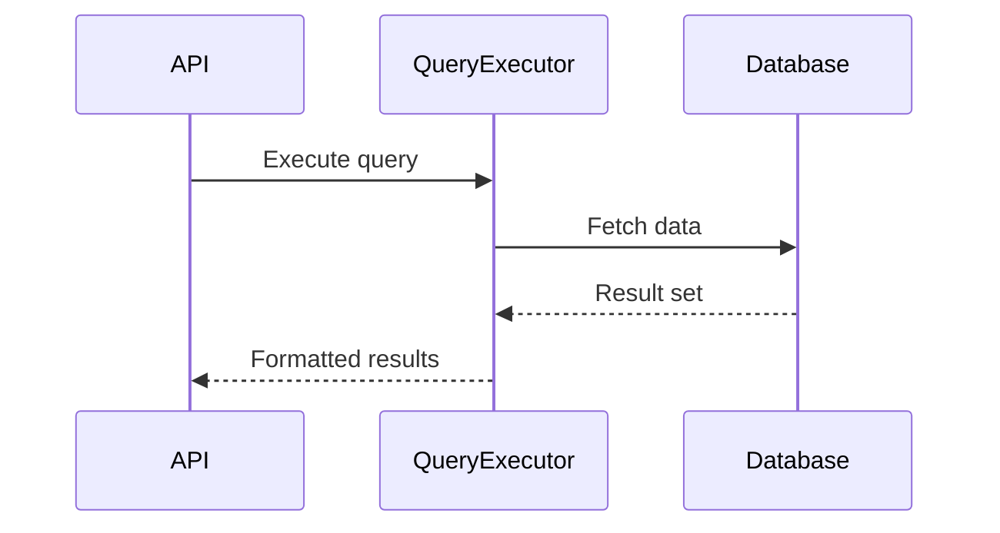
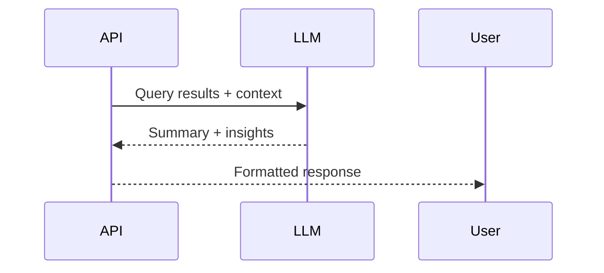
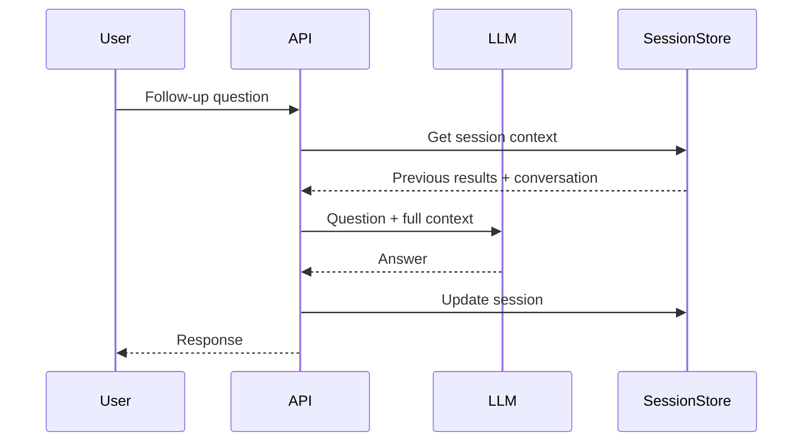
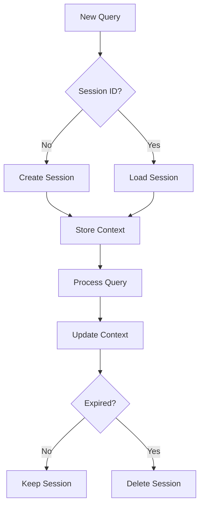
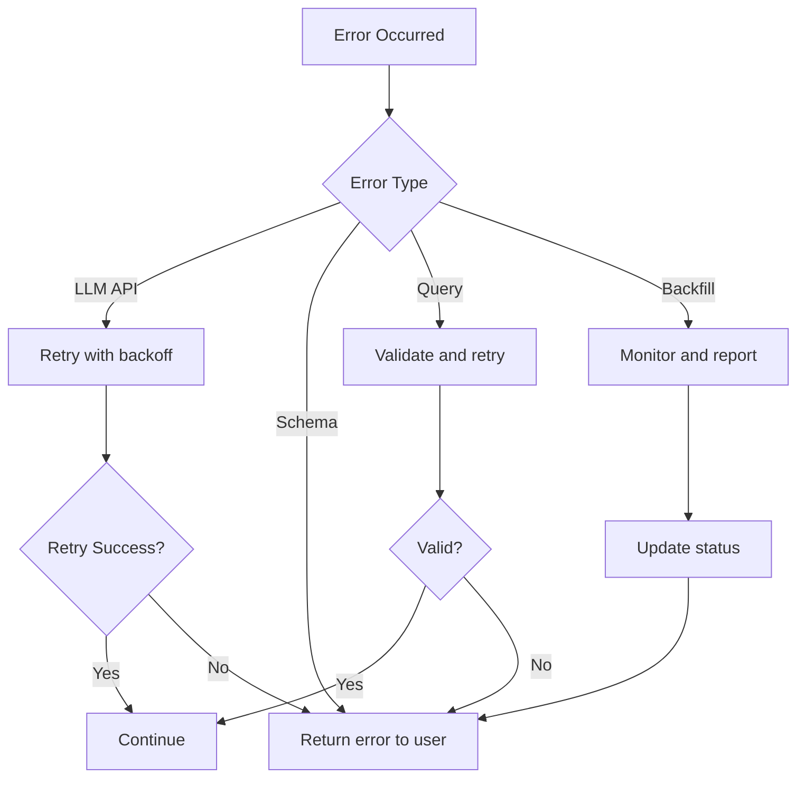

# LLM-Based Query Workflow

## Overview

This document describes the natural language query workflow that uses LLM to analyze queries, determine indexing needs, execute queries, and provide interactive results exploration.

## Architecture

### High-Level Flow



## Detailed Workflow Steps

### Step 1: Query Analysis

The user submits a natural language query which is sent to the LLM along with:
- List of available schemas
- Number of elements in each schema
- Current system state



**LLM Response Format:**
```typescript
{
  query_to_execute: Query,
  index_schema?: DeclarativeSchema,
  reasoning: string
}
```

### Step 2: Index Creation and Backfill

If the LLM determines an index is needed, the system creates a new schema and waits for backfill completion.



**Backfill Status Check:**


### Step 3: Query Execution

Once the index is ready (or immediately if no index needed), execute the query.



### Step 4: Result Summarization

Query results are sent to the LLM for summarization and presentation.



### Step 5: Interactive Q&A

Users can ask follow-up questions with full context of previous results.



## API Endpoints

### 1. Analyze Query
```
POST /api/llm-query/analyze
```

**Request:**
```json
{
  "query": "Find all blog posts about AI from last month",
  "session_id": "optional-session-id"
}
```

**Response:**
```json
{
  "session_id": "uuid",
  "query_plan": {
    "query": { /* Query object */ },
    "index_schema": { /* Optional schema */ },
    "reasoning": "Need date index for efficient filtering"
  }
}
```

### 2. Execute Query Plan
```
POST /api/llm-query/execute
```

**Request:**
```json
{
  "session_id": "uuid",
  "query_plan": { /* from analyze */ }
}
```

**Response:**
```json
{
  "status": "pending" | "running" | "complete",
  "backfill_progress": 0.75,
  "results": [ /* query results */ ],
  "summary": "LLM summary of results"
}
```

### 3. Ask Follow-up Question
```
POST /api/llm-query/chat
```

**Request:**
```json
{
  "session_id": "uuid",
  "question": "What's the average word count?"
}
```

**Response:**
```json
{
  "answer": "Based on the results...",
  "context_used": true
}
```

### 4. Get Backfill Status
```
GET /api/llm-query/backfill/{transform_id}
```

**Response:**
```json
{
  "status": "in_progress",
  "progress": 0.65,
  "total_records": 1000,
  "processed_records": 650,
  "estimated_completion": "2025-10-07T15:30:00Z"
}
```

## Session Management



**Session Context Structure:**
```typescript
{
  session_id: string,
  created_at: timestamp,
  last_active: timestamp,
  original_query: string,
  query_results: any[],
  conversation_history: Message[],
  schema_created: string | null,
  ttl: number  // 1 hour default
}
```

## LLM Prompt Templates

### Analysis Prompt
```
You are a database query optimizer. Analyze the following natural language query
and available schemas to create an execution plan.

Available Schemas:
{schema_list_with_counts}

User Query: {user_query}

Determine:
1. Which schema(s) to query
2. What filters to apply
3. If an index is needed (consider element count > 10,000 as threshold)

Respond with:
- query: The Query object to execute
- index_schema: Optional declarative schema for indexing
- reasoning: Your analysis
```

### Summarization Prompt
```
Summarize the following query results for the user.

Original Query: {original_query}
Results: {results}

Provide:
1. High-level summary
2. Key insights
3. Notable patterns or anomalies
```

### Chat Prompt
```
You are helping a user explore query results. Answer their question based on
the context provided.

Original Query: {original_query}
Results: {results}
Conversation History: {history}

User Question: {question}

Provide a clear, concise answer based on the data.
```

## Error Handling



## Implementation Notes

1. **LLM Integration**: Use existing ingestion LLM infrastructure (OpenRouter/Ollama)
2. **Schema Creation**: Leverage existing schema loading and approval flow
3. **Backfill Monitoring**: Use TransformEventMonitor to track progress
4. **Session Storage**: In-memory with TTL, can be persisted later
5. **Query Formatting**: Use existing hash->range->fields formatter

## Performance Considerations

- **Index Threshold**: Recommend index for schemas with >10,000 elements
- **Session TTL**: 1 hour default, cleanup on expiration
- **LLM Timeout**: 30 seconds for analysis, 60 seconds for summarization
- **Backfill Polling**: Every 500ms until complete
- **Max Results for LLM**: Limit to 1000 records, sample if more

## Future Enhancements

1. **Streaming Results**: WebSocket for real-time backfill updates
2. **Query Caching**: Cache common query patterns
3. **Multi-step Queries**: Chain multiple queries together
4. **Visualization**: Generate charts/graphs from results
5. **Query History**: Persist and reuse past successful queries

