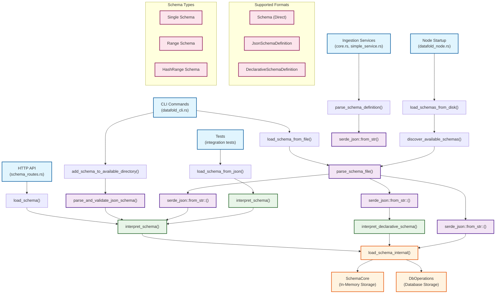

# Schema Parsing Architecture

This document provides a comprehensive overview of all schema parsing methods in the FoldDB system, their relationships, and usage patterns.

## Overview

The FoldDB schema system supports multiple parsing approaches to handle different schema formats and use cases. The parsing architecture is designed to be flexible, supporting both file-based and programmatic schema loading with multiple format support.

## Schema Parsing Methods

### Core Parsing Methods

1. **`parse_schema_file()`** - Multi-format file parser
2. **`interpret_schema()`** - JSON Schema interpretation
3. **`interpret_declarative_schema()`** - Declarative schema parsing
4. **`load_schema_from_json()`** - Direct JSON string parsing
5. **`load_schema_from_file()`** - File path parsing
6. **`parse_and_validate_json_schema()`** - JSON validation
7. **Direct serde parsing** - Low-level JSON parsing

## Architecture Diagram

## Detailed Method Descriptions

### 1. `parse_schema_file()` - Multi-format File Parser

**Location**: `src/schema/persistence.rs:19`

**Purpose**: Primary file-based parser that attempts multiple schema formats in sequence.

**Process**:
1. Reads file contents
2. Tries parsing as direct `Schema` object
3. Falls back to `JsonSchemaDefinition`
4. Falls back to `DeclarativeSchemaDefinition`
5. Returns `Option<Schema>` or error

**Callers**:
- `load_schemas_from_directory()` (persistence.rs:119)
- `discover_available_schemas()` (discovery.rs:15)

### 2. `interpret_schema()` - JSON Schema Interpreter

**Location**: `src/schema/schema_interpretation.rs:69`

**Purpose**: Converts `JsonSchemaDefinition` to `Schema` objects with validation.

**Process**:
1. Validates JSON schema structure
2. Creates field mappings
3. Generates molecule UUIDs
4. Returns validated `Schema`

**Callers**:
- `load_schema_from_json()` (schema_interpretation.rs:109)
- `add_schema_to_available_directory()` (schema_operations.rs:39)
- `parse_schema_file()` (persistence.rs:40)

### 3. `interpret_declarative_schema()` - Declarative Schema Parser

**Location**: `src/schema/persistence.rs:144`

**Purpose**: Converts `DeclarativeSchemaDefinition` to `Schema` objects for declarative transforms.

**Process**:
1. Extracts field definitions
2. Creates appropriate field types (Single/Range/HashRange)
3. Sets up default permissions and payment configs
4. Registers declarative transforms if approved

**Callers**:
- `parse_schema_file()` (persistence.rs:56)

### 4. `load_schema_from_json()` - JSON String Parser

**Location**: `src/schema/schema_interpretation.rs:94`

**Purpose**: Direct parsing of JSON schema strings.

**Process**:
1. Parses JSON string to `JsonSchemaDefinition`
2. Calls `interpret_schema()`
3. Returns validated `Schema`

**Callers**:
- CLI commands
- HTTP API endpoints
- Test utilities

### 5. `load_schema_from_file()` - File Path Parser

**Location**: `src/schema/schema_operations.rs:186`

**Purpose**: Loads schema from file path using file-based parsing.

**Process**:
1. Reads file contents
2. Calls `load_schema_from_json()`
3. Loads schema internally

**Callers**:
- CLI `LoadSchema` command (datafold_cli.rs:137)
- HTTP API endpoints
- Node initialization

### 6. `parse_and_validate_json_schema()` - JSON Validator

**Location**: `src/schema/schema_operations.rs:46`

**Purpose**: Validates JSON schema content before processing.

**Process**:
1. Parses JSON string to `JsonSchemaDefinition`
2. Validates structure
3. Returns validated schema definition

**Callers**:
- `add_schema_to_available_directory()` (schema_operations.rs:35)

### 7. Direct Serde Parsing - Low-level Parsing

**Location**: Various files

**Purpose**: Direct JSON deserialization for specific use cases.

**Process**:
1. `serde_json::from_str::<Schema>()` - Direct schema parsing
2. `serde_json::from_str::<JsonSchemaDefinition>()` - JSON schema parsing
3. `serde_json::from_str::<DeclarativeSchemaDefinition>()` - Declarative parsing

**Callers**:
- `parse_schema_file()` (persistence.rs:33,39,48)
- Test files
- Ingestion services

## Entry Points and Usage Patterns

### CLI Commands (`src/bin/datafold_cli.rs`)

- **`LoadSchema`**: Uses `load_schema_from_file()`
- **`AddSchema`**: Uses `add_schema_to_available_directory()`

### HTTP API (`src/datafold_node/schema_routes.rs`)

- **`load_schema_route()`**: Uses `load_schema()` → `interpret_schema()`
- **`unload_schema_route()`**: Direct schema management

### Node Startup (`src/datafold_node/node.rs`)

- **Node initialization**: Uses `load_schemas_from_disk()` → `parse_schema_file()`

### Tests

- **Integration tests**: Use `load_schema_from_json()` and direct serde parsing
- **Unit tests**: Use various parsing methods depending on test requirements

### Ingestion Services

- **`src/ingestion/core.rs`**: Uses `parse_schema_definition()` → direct serde parsing
- **`src/ingestion/simple_service.rs`**: Similar pattern

## Schema Format Support

### 1. Direct Schema Objects
- **Format**: Complete `Schema` struct
- **Usage**: Pre-compiled schemas, test fixtures
- **Parser**: `serde_json::from_str::<Schema>()`

### 2. JsonSchemaDefinition
- **Format**: JSON schema with field definitions
- **Usage**: Standard schema definitions
- **Parser**: `interpret_schema()`

### 3. DeclarativeSchemaDefinition
- **Format**: Declarative transform schemas
- **Usage**: Transform-based schemas
- **Parser**: `interpret_declarative_schema()`

## Schema Types Supported

### 1. Single Schema
- **Purpose**: Simple key-value storage
- **Key Support**: Optional hash/range keys

### 2. Range Schema
- **Purpose**: Ordered data with range keys
- **Key Support**: Range keys with optional hash keys

### 3. HashRange Schema
- **Purpose**: Complex indexing with hash and range
- **Key Support**: Both hash and range keys required

## Error Handling

All parsing methods return `Result<Schema, SchemaError>` or `Result<Option<Schema>, SchemaError>`, providing consistent error handling across the system.

## Performance Considerations

1. **File-based parsing**: More overhead due to multiple format attempts
2. **Direct serde parsing**: Fastest for known formats
3. **Interpretation**: Moderate overhead for validation and field mapping
4. **Caching**: Parsed schemas are cached in `SchemaCore` for performance

## Future Considerations

1. **Format detection**: Could be optimized to detect format before parsing
2. **Parallel parsing**: Multiple schema files could be parsed concurrently
3. **Lazy loading**: Schemas could be parsed on-demand rather than at startup
4. **Schema validation**: Additional validation layers could be added
